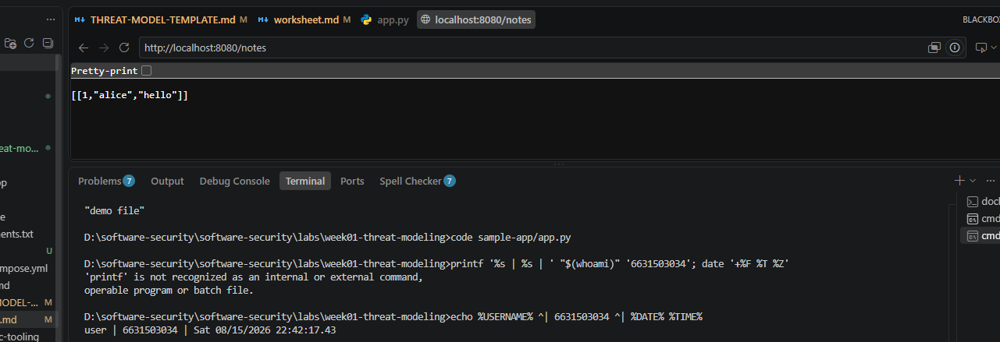
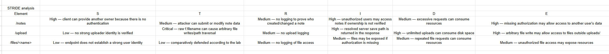
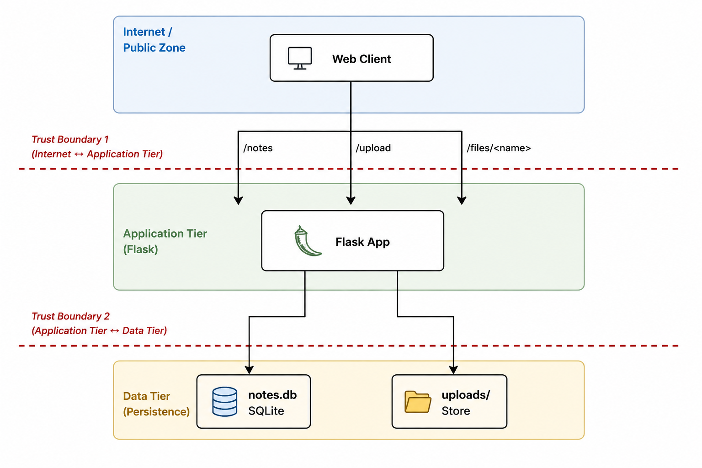

# Worksheet 1 — Security Mindset & Threat Modeling (3 hrs)

> **Course:** Software Security (KOSEN69) · **Week 1**
> **Aligned to:** OWASP 2025 A06 Insecure Design · CWE-501 (Trust Boundary Violation)
> **Signature game:** "Elevation of Privilege" (Microsoft STRIDE card deck)

> **Ethics note:** This week is *modeling only* — you analyze design, you do **not** attack the app. Run the sample app only on your own VM/localhost. Never apply these techniques to systems you do not own or lack written permission to test.

## Part 1 — Student Information
| Name | Student ID | Date | Group |
|Phuriphat Chantiuaong|6631503034|15/8/2026|---|
| | | | |

## Part 2 — Lecture Questions
Answer in your own words (2–4 sentences each).
1. CIA Triad
The CIA triad consists of Confidentiality, Integrity, and Availability. Confidentiality means that only authorized people can access data; for example, an attacker viewing another user's private notes is a confidentiality failure. Integrity means data cannot be changed without authorization, while availability means the system and its data remain accessible when needed.

2. Trust Boundary
A trust boundary is a point where data moves between areas with different levels of trust. Data crossing a trust boundary needs extra scrutiny because the receiving side cannot automatically trust that the data is safe or has been authorized.

3. Attack Surface
An attack surface is the collection of places where an attacker can interact with or influence a system. In a web application, adding more public API endpoints and allowing file uploads can increase the attack surface.

4. STRIDE
STRIDE represents six categories of security threats:
Letter	Threat	Security Property
S	Spoofing	Authentication
T	Tampering	Integrity
R	Repudiation	Non-repudiation / Accountability
I	Information Disclosure	Confidentiality
D	Denial of Service	Availability
E	Elevation of Privilege	Authorization

5. Secure by Design
Secure by Design means security is considered from the beginning of system design instead of being added after the application is finished. It focuses on preventing insecure designs and reducing the attack surface before vulnerabilities become production problems.

## Part 3 — Hands-on Lab (180 min)
**Learning goals:** build a data-flow diagram (DFD), apply STRIDE to a real Flask app, rank risks, and propose mitigations.
**Prerequisites:** Docker + Docker Compose in your VM; a drawing tool (draw.io / paper + photo); the Elevation of Privilege deck (print or virtual) — free print-and-play PDF at [github.com/adamshostack/eop](https://github.com/adamshostack/eop).

**Environment setup**
```bash
cd labs/week01-threat-modeling
docker compose up --build           # starts sample-app on http://localhost:8080
curl -s -X POST localhost:8080/notes -H 'Content-Type: application/json' \
     -d '{"owner":"alice","body":"hello"}'   # observe behavior, do not attack
curl -s localhost:8080/notes

echo "demo file" > demo.txt
curl -s -X POST localhost:8080/upload -F "file=@demo.txt"   # observe behavior, do not attack
curl -s localhost:8080/files/demo.txt
```

Source to model lives in `sample-app/app.py`. Template to fill: `THREAT-MODEL-TEMPLATE.md` (copy it, do not edit the original).

**What to submit per task:** the threat/element identified + a screenshot (DFD, table, or running app) + a 2–3 sentence mitigation.

**Task 0 — Onboarding (5 min)** · *Goal:* prove the environment works. *Steps:* `docker compose up`, hit `/notes` and `/files/<name>`, read `sample-app/app.py`. *Deliverable:* screenshot of the running app + the JSON response.

answer 

**Task 1 — Draw the DFD (25 min)** · *Goal:* map the system. *Steps:* identify the external entity (web client), the process (Flask app), the data store (`notes.db` SQLite), the `uploads/` store, and the flows for `/notes`, `/upload`, `/files/<name>`; mark the Internet→app trust boundary with a dashed line. *Deliverable:* DFD image embedded in your copy of the template.

answer  Element	Type	Description	Trust Boundary
Web Client	External Entity	Sends requests to the Flask application	Yes
Flask App	Process	Handles /notes, /upload, and /files/<name>	Yes
notes.db	Data Store	Stores notes data	Yes
uploads/	Data Store	Stores uploaded files	Yes
/notes	Data Flow	Sends note data between client and Flask app	Internet → Application
/upload	Data Flow	Sends uploaded files to the Flask app	Internet → Application
/files/<name>	Data Flow	Requests an uploaded file	Internet → Application
DFD
                         INTERNET
                            |
                            |
                    . . . . . . . . .
                    . Trust Boundary .
                    . . . . . . . . .
                            |
                            v
                    +---------------+
                    |   Web Client  |
                    +---------------+
                            |
             +--------------+--------------+
             |              |              |
             | /notes       | /upload      | /files/<name>
             v              v              v
                    +---------------+
                    |   Flask App   |
                    +---------------+
                       |           |
                       |           |
                       v           v
                 +---------+   +----------+
                 | notes.db|   | uploads/ |
                 | SQLite  |   |  Store   |
                 +---------+   +----------+
                
                 

**Task 2 — STRIDE the elements (30 min)** · *Goal:* enumerate threats per element. *Steps:* for each element fill the S/T/R/I/D/E grid. Ground it in real code: `/notes` accepts a client-supplied `owner` with no auth (Spoofing); `/upload` saves raw `f.filename` — arbitrary-file-write (Tampering) — and echoes the resolved save path back in its response (Information disclosure); `/files/<name>` reads it back but is comparatively defended (see Task 5); no logging anywhere (Repudiation). *Deliverable:* completed STRIDE table.

answer  

Flask App	Requests are accepted without strong authentication for /notes	/upload uses the raw f.filename, allowing an attacker-controlled filename to affect where a file is saved	No logging exists	/upload returns the resolved save path	Uploads and requests can consume server resources	Missing authorization can allow access to functionality that should be restricted
notes.db	No strong owner identity is enforced by the application	Unauthorized users may create or modify note data	No audit trail	Notes may be exposed if access control is missing	Excessive writes can consume storage/resources	Unauthorized access to notes may become a privilege problem
uploads/	Uploaded content is associated with attacker-controlled filenames	Raw filenames can cause arbitrary file writes/path traversal	No record of who uploaded a file	The resolved save path is returned by /upload	Unlimited uploads can consume disk space	A malicious uploaded file could potentially affect files outside the intended upload directory

**Task 3 — Elevation of Privilege game (20 min)** · *Goal:* find threats you missed. *Steps:* play the EoP deck against your DFD; each card you can tie to a real element/flow scores a point; record every valid threat. No printer or scissors? Draw from the digital deck below instead — same 78 cards, same rule. *Deliverable:* list of carded threats + score.

```sim
eop-deck
Cards drawn: 10 · Tied to my DFD: 6

```

**Task 3b — Systems-level pass (25 min) 🔭** · *Goal:* find what the per-element grid cannot see. Tasks 2 and 3 enumerate threats **one element at a time**, and that is exactly where threat models are known to stop short — students taught STRIDE alone reliably identify component threats and *discount system-level ones* ([Joshi et al., ASEE 2024](https://arxiv.org/abs/2404.16632)). So do a second pass over the **whole** diagram:


- **Trust boundaries end-to-end.** Follow one request from the client to `notes.db` and back. List every boundary it crosses. Which crossing has no check on it?
- **Assume one element is fully owned.** Pick the Flask process, then the `uploads/` store. For each: what does the attacker now *reach* — not what is it, but where does it get them?
- **Chain two "low" findings.** Find two threats you or the EoP deck rated minor that combine into something you would not accept. Write the chain as `A → B → consequence`.
- **One-line system claim.** Finish: "Even if every element-level mitigation in Task 8 is implemented, this system still fails if ___."

Use the simulation below before you start — toggle a component to attacker-controlled and watch what it reaches:

answer The request crosses two trust boundaries: Internet → Application Tier and Application Tier → Data Tier. The Internet → Application boundary has no authentication check, especially for /notes, where the client can supply an arbitrary owner.
```sim
trust-boundary
```

*Deliverable:* the boundary list, two owned-element reachability notes, one written chain, and the system claim.

**Task 4 — Abuse cases & attacker personas (20 min)** · *Goal:* think like specific adversaries. *Steps:* define 2 personas (e.g. a curious logged-in user; an anonymous internet attacker) and write 2 abuse cases each against the sample app, tied to DFD elements. *Deliverable:* 4 abuse cases.

answer
Persona 1 — Anonymous Internet Attacker
Abuse Case 1: Arbitrary File Write

Goal: Modify or create a file outside the intended upload directory.

Attack:

The attacker sends an upload request containing a malicious filename using path traversal characters such as ../.

Target: /upload → uploads/

Impact: The application may save the file outside the intended directory.

Abuse Case 2: Information Disclosure

Goal: Learn information about the server's file system.

Attack:

The attacker uploads a file and observes the resolved save path returned by the application.

Target: /upload

Impact: The returned path can disclose information about the server's file-system structure.

Persona 2 — Curious Logged-in User
Abuse Case 3: Spoof Another Owner

Goal: Make the application treat a note as belonging to another user.

Attack:

The user changes the client-supplied owner field in the /notes request.

Target: /notes

Impact: The application may accept an attacker-selected owner because the owner value is not verified against an authenticated identity.

Abuse Case 4: Access Another User's Data

Goal: Access information belonging to another user.

Attack:

The user modifies request parameters to reference another owner or resource.

Target: /notes

Impact: If authorization is not enforced, users may access data they do not own.

**Task 5 — Path-traversal deep-dive (25 min)** · *Goal:* analyze the riskiest flow. *Steps:* trace `/upload` → `/files/<name>`; explain how `../` in a filename escapes `uploads/`; sketch the secure design (`secure_filename`, store outside web root, allow-list extensions). *Deliverable:* the data flow + secure-design note.

answer
Web Client
    |
    | POST /upload
    | filename = attacker-controlled value
    v
+-------------+
| Flask App   |
+-------------+
    |
    | uses f.filename
    v
+-------------+
|  uploads/   |
+-------------+
    |
    | GET /files/<name>
    v
+-------------+
| Flask App   |
+-------------+

The problem is that /upload saves the uploaded file using the raw f.filename.

An attacker can manipulate the filename so that it contains path traversal components such as ../. If the application joins that filename with the uploads/ directory without safely normalizing and restricting it, the resulting path can point outside the intended upload directory.

For example, conceptually:

uploads/../some-file

can resolve to a location outside uploads/.

Secure Design

A safer design should:

Use secure_filename() to sanitize user-controlled filenames.
Allow only approved file extensions.
Store uploaded files outside the web root when possible.
Generate server-side filenames instead of trusting the original filename.
Prevent user-controlled strings from becoming arbitrary file-system path components.
Apply file-size limits to reduce resource exhaustion.
Secure flow
Client filename
      ↓
Validate filename
      ↓
secure_filename()
      ↓
Allow-list extension
      ↓
Generate safe server-side filename
      ↓
Store outside web root
      ↓
Return only safe resource information

**Task 6 — Threat-model the project target (30 min)** · *Goal:* kick off your term project. *Steps:* stop the sample-app first (`docker compose down` — both apps bind host port 8080), then run **NoteVault** (`cd ../../project/starter-app && docker compose up`), draw a quick DFD, and list the top 3 STRIDE threats you'd investigate. *Deliverable:* NoteVault DFD + top-3 threats (reuse these in your project report — `project/REPORT-TEMPLATE.md` in the repo root).

answer
INTERNET
                       |
                       | Trust Boundary
                       v
                +--------------+
                |  Web Client  |
                +--------------+
                       |
                       v
                +--------------+
                |   NoteVault  |
                | Application  |
                +--------------+
                    |       |
                    |       |
                    v       v
               +--------+ +-----------+
               | Notes  | | User Data |
               | Store  | | / Database|
               +--------+ +-----------+
Top 3 STRIDE Threats to Investigate
1. Spoofing

An attacker may attempt to impersonate another NoteVault user if authentication is weak or missing.

Investigation: Check whether every protected request requires a valid authenticated identity.

2. Tampering

An attacker may attempt to modify another user's notes by changing an identifier in a request.

Investigation: Check whether the server verifies that the authenticated user owns the requested note.

3. Information Disclosure

An attacker may attempt to access another user's notes or sensitive user information.

Investigation: Check authorization on every data-access endpoint.

**Task 7 — Security requirements (15 min)** · *Goal:* turn threats into testable requirements. *Steps:* write 3 security requirements as acceptance criteria ("the system must … so that …"), each mapped to a threat from Task 2 or Task 6. *Deliverable:* 3 testable security requirements.
answer
Requirement 1 — Authentication

The system must require authentication before allowing a user to create, modify, or access protected notes so that anonymous users cannot impersonate legitimate users.

Mapped threat: Spoofing

Requirement 2 — File Upload Protection

The system must validate and sanitize uploaded filenames and restrict file types so that attacker-controlled filenames cannot cause files to be written outside the intended upload directory.

Mapped threat: Tampering / Path Traversal

Requirement 3 — Request Logging

The system must record important security-sensitive requests with the authenticated user, timestamp, action, and result so that suspicious actions can be investigated later.

Mapped threat: Repudiation

**Task 8 — Defend / fix it: rank & mitigate (25 min) 🛡️** · *Goal:* turn threats into action you can prove. *Steps:* rank the top 5 threats by likelihood × impact; propose one concrete mitigation each (e.g., auth on `/notes`, `secure_filename()` + allowlist for `/upload`, request logging for Repudiation, size/rate limits for DoS). Then **pick one and actually implement it** in your fork.

*Deliverable — the top-5 table, plus for the one you implemented:*
1. the **diff** (commit hash on your `wk01` branch),
2. **evidence it works**: the request that succeeded before your change and is refused after — both outputs,
3. **why it closes the class, not the instance** (2–3 sentences). `secure_filename()` on one endpoint is an instance fix; *"no user-supplied string ever becomes a path component"* is a class fix. Say which yours is, and if it's an instance fix, say what the class fix would be.

answer
Top 5 Threats

Task 8 — Rank & Mitigate
Top 5 Threats
Rank	Threat	Likelihood	Impact	Risk	Mitigation
1	Path traversal / arbitrary file write	High	High	Critical	Use secure_filename(), allow-list extensions, generate server-side filenames, and store uploads safely
2	Missing authentication on /notes	High	High	Critical	Require authentication and use the authenticated identity instead of trusting client-supplied owner
3	Missing authorization	Medium	High	High	Verify that the authenticated user is authorized to access the requested note/file
4	Information disclosure of resolved file path	Medium	Medium	Medium	Do not return internal server paths in API responses
5	No request/file-size limits	Medium	Medium	Medium	Add request-size, upload-size, and rate limits
Mitigation Details
1. Path Traversal

Use filename sanitization and server-generated filenames. Do not allow an arbitrary user-provided string to become a path component.

2. Authentication

Require authentication for protected endpoints and derive the owner from the authenticated session/token rather than accepting it directly from the client.

3. Authorization

After authentication, verify that the authenticated user owns or has permission to access the requested resource.

4. Information Disclosure

Return a safe logical file identifier instead of exposing the server's resolved file-system path.

5. DoS Protection

Limit upload sizes and request rates so that an attacker cannot easily exhaust CPU, memory, or disk resources.

Task 8 — Implemented Fix
Selected Finding

Path traversal / arbitrary file write in /upload

Before

The vulnerable behavior is that the application saves the uploaded file using the client-controlled f.filename.

Conceptually:

filename = f.filename
save_path = os.path.join("uploads", filename)
f.save(save_path)

The problem is that the filename originates from the attacker.

After

The secure implementation should sanitize the filename before using it as a file-system path component and should preferably generate a server-side filename.

Example:

from werkzeug.utils import secure_filename

filename = secure_filename(f.filename)

if not filename:
    return {"error": "Invalid filename"}, 400

save_path = os.path.join("uploads", filename)
f.save(save_path)

A stronger class-level solution is to avoid using user-controlled strings as path components altogether by generating a server-side identifier.

Why the fix works

secure_filename() removes unsafe path-related characters and converts the input into a safer filename. However, using secure_filename() alone is mainly an instance-level mitigation; the stronger class-level rule is that no untrusted user input should directly determine a file-system path.

> **Why this is weighted.** Fewer than half of working developers can spot a security hole in code, and being shown vulnerabilities does not by itself teach you to find or close them. Exploiting is the half that feels like progress; defending is the half that transfers to your job.

## Part 4 — Reflection
1. Map your top finding to a CWE and to OWASP A06 (Insecure Design); explain the mapping in one sentence.
  answer CWE and OWASP A06 Mapping
The path traversal/arbitrary file-write vulnerability can be mapped to CWE-22 (Improper Limitation of a Pathname to a Restricted Directory) and relates to OWASP A06: Insecure Design because the application design allows attacker-controlled input to influence a sensitive file-system operation without enforcing a safe path boundary.
2. Name one real-world breach caused by a design flaw (not a missing patch) and what design control would have prevented it.
   answer Real-World Breach Caused by a Design Flaw
One example is the Capital One 2019 data breach, where an attacker exploited a misconfigured cloud environment and gained access to data that should not have been reachable.
A design control that could have reduced the risk was stronger least-privilege access control and defense-in-depth around cloud resources, so that access to one component would not automatically provide access to sensitive data.
3. Of your five mitigations, which gives the most risk reduction per unit of effort, and why?
   answer Best Risk Reduction per Unit of Effort
The highest risk reduction for relatively low implementation effort is protecting the file-upload functionality.
The reason is that filename validation and safe server-side file naming directly address a high-impact arbitrary-file-write/path-traversal vulnerability. It is a small code change compared with redesigning the entire application authentication system, while significantly reducing the attack surface.

## Grading rubric (100)
| Criterion | Points |
|---|---|
| Lecture questions (Part 2) | 20 |
| Exploitation + evidence (DFD + STRIDE table + EoP findings + screenshots) | 40 |
| Defense (top-5 ranking + mitigations) | 25 |
| Reflection (CWE/OWASP mapping + breach + best mitigation) | 15 |

**Assessed within the rows above** (they are not extra points — they are what those points are for):
- **Systems-level reasoning** (inside *Exploitation + evidence*, Task 3b): does the model reach past single elements to boundaries, reachability and chains? Scored with the STRIDE + systems-thinking rubrics of [Joshi et al. 2024](https://arxiv.org/abs/2404.16632).
- **Defensive proof** (inside *Defense*, Task 8): a claimed mitigation with no before/after evidence scores at most half. A mitigation you can show closing a *class* scores full.
- **Adversarial thinking** (across the whole sheet): do the abuse cases, personas and chains show you reasoning as an attacker with goals and constraints — or just listing categories? This is the course's central disposition and it is assessed, not assumed.

---

## Evidence & Integrity (required)

- **Identity proof:** every screenshot/diagram must show a terminal running `printf '%s | %s | ' "$(whoami)" '<YOUR-STUDENT-ID>'; date '+%F %T %Z'` **in the
  same image as the evidence**. When the evidence is a browser page, a DevTools panel or a
  rendered response, put that terminal **beside the browser and capture the whole screen** — a
  cropped window carries nothing that identifies you, and the lab's own output is
  byte-identical for the whole cohort *by design*, so the stamp is the only thing that makes
  the shot yours. Generic or borrowed evidence is not accepted.
- **Personalized flag (if this lab issues one):** ____________________
  *Flags are unique per student — submitting another student's flag is a violation. How to submit: **learn.zcr.ai/submit** (full guide: `SUBMISSION.md` in the repo root).*
- **Explain in your own words** *(graded on your reasoning, not copied text):*
  1. What did you do, and **why did the vulnerability work**?
  2. **Why does your fix actually stop it** — and what could still break it?

---

## 🤖 Audit the AI (required)

AI is a power tool you must **distrust** — you are graded on your *critique*, not the AI's answer.

1. Ask an AI assistant to exploit **or** fix this week's vulnerability. Paste its full answer.
   answer Important This section should use the actual AI answer you submitted/received. The example below is only a model for how to perform the critique and should not be falsely presented as an actual AI response.
2. **Find what's wrong or risky** in it — insecure code, a subtly incomplete fix, a hallucinated API/function/CVE, a missed edge case, or wrong reasoning. Quote the exact line(s).
   answer An AI might suggest:
filename = secure_filename(f.filename)
save_path = os.path.join("uploads", filename)
f.save(save_path)
Problem With This Answer
The code is safer than directly using f.filename, but it may still be incomplete as a complete security design.
For example:
It does not enforce an allow-list of file extensions.
It does not impose a file-size limit.
It still uses a user-derived filename as part of the path.
It does not necessarily prevent overwriting an existing file.
It does not address storage outside the web root.
Therefore, the AI's answer may fix the demonstrated path traversal instance but does not completely solve the broader class of unsafe file-storage problems.
3. Produce the **correct, verified** version yourself and explain in 2–3 sentences why the AI's output was insufficient.
   answer A stronger solution is:

from uuid import uuid4
from werkzeug.utils import secure_filename
original_name = secure_filename(f.filename)
if not original_name:
    return {"error": "Invalid filename"}, 400
allowed_extensions = {"txt", "pdf", "png", "jpg", "jpeg"}
extension = original_name.rsplit(".", 1)[-1].lower()
if extension not in allowed_extensions:
    return {"error": "File type not allowed"}, 400
stored_name = f"{uuid4().hex}.{extension}"
save_path = os.path.join("uploads", stored_name)
f.save(save_path)
This approach separates the user-provided filename from the actual server-side storage name.

> Disclose your AI use in the Part 1 table. This task counts toward your **Defense + Reflection** score.

---

## 🧠 Comprehension & Prompt (required)

**A. Explain in Plain English (EiPE).** In 2–3 sentences, in your own words, describe what this week's vulnerable code/endpoint actually *does* and *why it is exploitable* — explain the mechanism, don't dump jargon.
 
 answer The /upload endpoint accepts a filename supplied by the client and uses that filename when saving the uploaded file. Because the filename is not safely restricted, an attacker can manipulate it with path traversal characters such as ../ to make the application save the file outside the intended uploads/ directory.
 
**B. Prompt Problem.** Write a **single prompt** that makes an AI produce a *correct, secure* fix for one finding. Run it: does the exploit now fail? If not, refine the prompt and try again. Submit the **final prompt + the verified result**.
*Graded on the prompt's precision and your verification — this trains problem decomposition and AI literacy (Denny et al. 2024).*

answer
Final Prompt
Review the Flask /upload endpoint for path traversal and arbitrary file-write vulnerabilities. The uploaded filename is controlled by the client and must never be allowed to determine an arbitrary filesystem path.
Provide a secure fix that:
1. Sanitizes the original filename with Werkzeug's secure_filename().
2. Uses an allow-list of permitted file extensions.
3. Generates a server-side random filename instead of using the user-controlled filename as the storage path.
4. Prevents path traversal and overwriting unintended files.
5. Limits uploaded file size.
6. Does not expose the server's absolute filesystem path in the response.
Explain why the original implementation is vulnerable, why each part of the fix works, and identify any remaining security risks. Provide the complete corrected Flask code for the endpoint.
Verification
The fix should be verified by sending the same malicious upload request before and after the change.
Expected result:
Before:The malicious filename is accepted and the application attempts to save it.
After:The filename is rejected/sanitized and the application stores the file only under a safe server-generated filename.
The actual before/after outputs should be copied from the student's terminal.