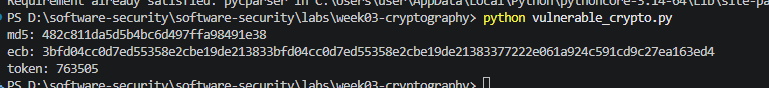
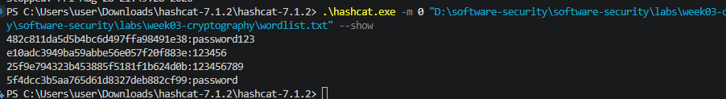
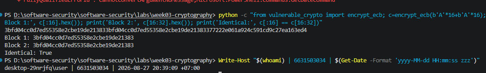
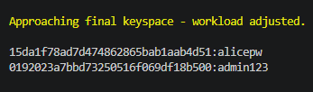

# Worksheet 3 — Cryptography Used Correctly (and Misused) (3 hrs)

> **Course:** Software Security (KOSEN69) · **Week 3**
> **Aligned to:** OWASP 2025 A04 Cryptographic Failures · CWE-327, CWE-916, CWE-330, CWE-798
> **Signature game:** "Capture the Hash" (recover plaintext from weak hashes)

> **Ethics note:** Crack only the hashes provided in `hashes.txt` on your own machine. Password-cracking against accounts or systems you don't own is illegal. Wordlists and recovered values stay inside the lab VM.

## Part 1 — Student Information
| Name | Student ID | Date | Group |
|Phuriphat Chantiuaong|6631503034|25/8/2569|---|
| | | | |

## Part 2 — Lecture Questions
Answer in your own words (2–4 sentences each).
1. Distinguish hashing, encryption, and encoding — and give one job each is the wrong tool for.
   answer Hashing / Encryption / Encoding
   Hashing เป็นการแปลงข้อมูลเป็นค่า digest ที่ออกแบบมาให้ย้อนกลับเป็นข้อมูลเดิมไม่ได้ เหมาะกับการเก็บ password
   Encryption แปลงข้อมูลด้วย key เพื่อให้ผู้ที่มี key สามารถถอดกลับได้ เหมาะกับการปกป้องข้อมูลลับ
   Encoding เป็นการเปลี่ยนรูปแบบข้อมูลเพื่อให้ส่งหรือเก็บได้สะดวก เช่น Base64 และไม่ได้มีไว้เพื่อความลับ 
2. Why is a fast hash like MD5/SHA-1 a bad choice for storing passwords, and what should be used instead?
   answer MD5 และ SHA-1 เป็น hash ที่เร็วมาก ทำให้ผู้โจมตีสามารถลอง password จำนวนมากต่อวินาทีได้ นอกจากนี้ MD5 ยังไม่มี salt ในรูปแบบการใช้งานที่โจทย์ให้มา จึงเสี่ยงต่อการโจมตีด้วย wordlist และ rainbow tables ควรใช้ password KDF เช่น Argon2id ที่ออกแบบมาให้ช้ากว่าและใช้ memory สูง
3. What is a salt, what attack does it defeat, and why must it be unique per password?
   answer Salt คือข้อมูลสุ่มที่เพิ่มเข้าไปก่อนทำ password hash เพื่อให้ password เดียวกันสร้าง hash ที่แตกต่างกัน การใช้ salt ช่วยป้องกัน precomputed/rainbow-table attacks และทำให้ผู้โจมตีต้อง crack แต่ละ password แยกกัน Salt ควรไม่ซ้ำกันในแต่ละ password
4. Why does AES-ECB leak structure, and what does an authenticated mode like AES-GCM add?
   answerAES-ECB encrypt แต่ละ block แยกกันด้วยวิธีที่ทำให้ plaintext block ที่เหมือนกันสร้าง ciphertext block ที่เหมือนกัน จึงสามารถเปิดเผยรูปแบบของข้อมูลได้ AES-GCM เพิ่ม authenticated encryption ซึ่งให้ทั้ง confidentiality และ integrity/authentication ผ่าน authentication tag
5. What's the difference between `random` and a CSPRNG (e.g. `secrets`), and where does it matter?
   answer random ใน Python ไม่ได้ถูกออกแบบสำหรับ security-sensitive randomness จึงไม่ควรใช้สร้าง password reset token หรือ session token ส่วน CSPRNG เช่น secrets ถูกออกแบบให้ค่าที่สร้างขึ้นคาดเดาได้ยาก จึงเหมาะกับ token, password reset และ security-sensitive values


## Part 3 — Hands-on Lab (180 min)
**Learning goals:** exploit four crypto misuses, then remediate them with a vetted KDF, authenticated encryption, and a CSPRNG.
**Prerequisites:** Docker (or local Python 3.12); `hashcat` or `john`; the `rockyou.txt` wordlist.

**Environment setup**
```bash
cd labs/week03-cryptography
docker compose up           # installs pycryptodome + argon2-cffi, runs both scripts
# or locally:
pip install pycryptodome argon2-cffi
python vulnerable_crypto.py # see the md5 hash, repeated ECB blocks, 6-digit token
```
Targets: `vulnerable_crypto.py` (the misuses), `hashes.txt` (four unsalted MD5s), and `solution_skeleton.py` (the fix).

**What to submit per task:** the command/payload run + a screenshot of the result + a 2–3 sentence mitigation.

**Task 0 — Onboarding (5 min)** · *Goal:* see the misuse output. *Steps:* run `python vulnerable_crypto.py`; note the md5 digest, the identical ECB ciphertext blocks, and the short token. *Deliverable:* screenshot of the program output.
answer 

**Task 1 — Capture the Hash (30 min)** · *Goal:* recover the passwords. *Steps:* strip the comment lines from `hashes.txt`, then run `hashcat -m 0 hashes.txt rockyou.txt` (or the `john --format=raw-md5` equivalent); recover all four plaintexts. *Deliverable:* screenshot of the cracked results (mask any real-looking value). Note in one line why unsalted MD5 fell so fast (CWE-916/327).
Answer 
```sim
aes-modes
```

**Task 2 — ECB structure leak (20 min)** · *Goal:* prove ECB leaks. *Steps:* call `encrypt_ecb(b"A"*16 + b"A"*16)` from `vulnerable_crypto.py` and show the two 16-byte ciphertext blocks are identical; explain how this leaks plaintext structure (CWE-327). *Deliverable:* hex output highlighting the repeated block.
Answer 
         AES-ECB encrypts each 16-byte block independently. เมื่อ plaintext block เหมือนกัน ciphertext block จึงเหมือนกัน ทำให้ผู้สังเกตสามารถเห็นรูปแบบหรือโครงสร้างของข้อมูลได้ แม้จะไม่เห็น plaintext โดยตรง. การแก้ไขคือใช้ authenticated encryption เช่น AES-GCM แทน ECB.

**Task 3 — Predictable token (15 min)** · *Goal:* show the reset token is guessable. *Steps:* call `reset_token()` repeatedly; argue why a 6-digit `random` token (10^6 space, non-CSPRNG) is brute-forceable (CWE-330). *Deliverable:* sample tokens + a one-line attack estimate.
Answer
Token สำหรับ reset มีเพียง 6 หลัก ทำให้ผู้โจมตีมีค่าที่เป็นไปได้เพียง 1,000,000 ค่าในการลองเดา นอกจากนี้ยังใช้ random ของ Python     ซึ่งเป็นตัวสร้างค่าทั่วไปและไม่ได้ออกแบบมาสำหรับงานด้านความปลอดภัย จึงไม่ควรนำมาใช้สร้าง token ที่มีความสำคัญด้านความปลอดภัย วิธีแก้คือใช้ secrets และสร้าง token ที่มีความยาวเพียงพอและคาดเดาได้ยาก

**Task 4 — Hardcoded key (5 min)** · *Goal:* identify the key-management flaw. *Steps:* find `HARDCODED_KEY` in `vulnerable_crypto.py`; explain why shipping a key in source is CWE-798. *Deliverable:* the line + a 2-sentence mitigation.
Answer 
กุญแจเข้ารหัสถูกฝังไว้โดยตรงในซอร์สโค้ด ดังนั้นใครก็ตามที่สามารถเข้าถึงซอร์สโค้ดของแอปพลิเคชันได้       ก็อาจสามารถเข้าถึงกุญแจได้เช่นกันควรจัดเก็บและส่งกุญแจผ่านระบบจัดการข้อมูลลับ (Secret Management) ที่ปลอดภัย หรือใช้ตัวแปรสภาพแวดล้อม (Environment Variable) และควรเปลี่ยนกุญแจใหม่หากพบว่ากุญแจเดิมถูกเปิดเผยหรือรั่วไหลแล้ว  

**Task 5 — Crack the project target's hashes (25 min)** · *Goal:* apply cracking to your term project. *Steps:* **NoteVault** stores unsalted MD5 password hashes; obtain them (via the app's `/admin` once you can reach it, or from its `seed()`), and crack them with `hashcat -m 0`. *Deliverable:* the recovered password(s) + note the CWE — record this finding for your project report (`project/REPORT-TEMPLATE.md` in the repo root).
Answer
Target: NoteVault
NoteVault เก็บรหัสผ่านเป็น unsalted MD5 hash ซึ่งสามารถ crack ได้ด้วย Hashcat
Recovered passwords:
Username	   Password
alice	      alicepw
admin	      admin123

CWE:
CWE-916 — Use of Password Hash With Insufficient Computational Effort
Explanation:
NoteVault ใช้ MD5 ซึ่งเป็น hash ที่คำนวณได้เร็วและไม่มี salt ทำให้ผู้โจมตีสามารถใช้ dictionary attack หรือ brute-force เพื่อ crack password ได้ง่ายและรวดเร็ว
Impact:
หากผู้โจมตีได้ database ที่มี password hashes อาจสามารถกู้คืนรหัสผ่านของผู้ใช้ได้ และถ้าผู้ใช้ใช้รหัสผ่านเดียวกันกับระบบอื่น บัญชีอื่นก็อาจได้รับผลกระทบด้วย
Recommendation:
ควรเปลี่ยนจาก MD5 เป็น password hashing algorithm ที่ออกแบบมาสำหรับ password เช่น Argon2id และใช้ unique salt สำหรับแต่ละ password

**Task 6 — Password storage migration (25 min)** · *Goal:* fix it the way real apps do. *Steps:* write `store_password`/`verify_password` with **argon2id**, and a **rehash-on-login** path that upgrades a legacy MD5 record to argon2id the next time the user logs in. *Deliverable:* the code + a short note on why migration matters.
Answer
ผมได้แก้ไขการจัดเก็บรหัสผ่านโดยเปลี่ยนจาก MD5 เป็น Argon2id โดยใช้ฟังก์ชัน store_password() สำหรับสร้าง Argon2id hash และ verify_password() สำหรับตรวจสอบรหัสผ่าน
นอกจากนี้ได้เพิ่มระบบ rehash-on-login เมื่อผู้ใช้ที่มีรหัสผ่านแบบ MD5 เข้าสู่ระบบสำเร็จ ระบบจะตรวจพบว่าเป็น Legacy MD5 และทำการสร้าง Argon2id hash ใหม่ จากนั้นนำ hash ใหม่ไปใช้แทน MD5 เดิม
ผลการทดสอบ:
=== Before Migration ===
Stored MD5 hash:
482c811da5d5b4bc6d497ffa98491e38
Login successful
Legacy MD5 detected.
Migrating password to Argon2id...

=== After Login ===
Login successful: True
Stored hash:
$argon2id$v=19$m=65536,t=3,p=4$WzYopRSUxuWHjUVplIwaEA$IZhc04pIEcjaCCIKVrCpUHCJ+oZdKjyLWu6PIODC/P8

=== Verification ===
Argon2id verification: True
ผลการทดสอบแสดงให้เห็นว่า MD5 เดิมสามารถถูกตรวจสอบได้ และหลังจาก Login สำเร็จ ระบบสามารถ migrate รหัสผ่านจาก MD5 เป็น Argon2id ได้สำเร็จ
เหตุผลที่ต้องทำ Password Migration:
MD5 ไม่เหมาะสำหรับการจัดเก็บรหัสผ่าน เพราะเป็นอัลกอริทึมที่ทำงานเร็วมาก ทำให้ผู้โจมตีสามารถใช้ brute-force หรือ dictionary attack เพื่อเดารหัสผ่านได้ง่ายขึ้น
Argon2id ถูกออกแบบมาสำหรับการทำ Password Hashing โดยเฉพาะ และใช้ทรัพยากรด้านเวลาและหน่วยความจำมากกว่า ทำให้การโจมตีด้วยการเดารหัสผ่านทำได้ยากขึ้น
การใช้ rehash-on-login ช่วยให้ระบบสามารถทยอยเปลี่ยนรหัสผ่านของผู้ใช้จาก MD5 เป็น Argon2id ได้ โดยไม่จำเป็นต้องบังคับให้ผู้ใช้ทุกคนเปลี่ยนรหัสผ่านพร้อมกัน

**Task 7 — Authenticated encryption round-trip (20 min)** · *Goal:* use AEAD correctly. *Steps:* encrypt+decrypt a message with **AES-GCM** using a random 12-byte nonce and a key from an env var; then flip one ciphertext byte and show decryption **fails** (tag check). *Deliverable:* the round-trip output + the tampered-fails proof.
Answer
AES-GCM สามารถเข้ารหัสและตรวจสอบความถูกต้องของข้อมูลได้ด้วย authentication tag เมื่อ ciphertext ถูกแก้ไขแม้เพียง 1 byte การตรวจสอบ tag จะไม่ผ่านและการ decrypt จะล้มเหลว ทำให้ผู้โจมตีไม่สามารถแก้ไข ciphertext โดยไม่ถูกตรวจพบ

**Task 8 — TLS in practice (15 min)** · *Goal:* read a real cert. *Steps:* run `openssl s_client -connect example.com:443 </dev/null 2>/dev/null | tee /tmp/tls.txt | openssl x509 -noout -issuer -subject -dates` for the cert summary, then `grep -E 'Protocol|New,' /tmp/tls.txt` for the negotiated TLS version (the version line is printed by `s_client`, not by `x509`, so the plain pipe would discard it); identify issuer, validity, and that TLS version. *Deliverable:* the cert summary + one line on what TLS protects that hashing/at-rest encryption does not.
ANswer 
TLS ช่วยปกป้องข้อมูลในขณะที่กำลังส่งระหว่างปลายทาง โดยให้ ความลับ (Confidentiality) และ ความถูกต้องของข้อมูล (Integrity) และเมื่อมีการตรวจสอบใบรับรอง (Certificate Validation) อย่างถูกต้อง ก็จะช่วยยืนยันตัวตนของเซิร์ฟเวอร์ได้ด้วย
ส่วน Hashing เป็นการแปลงข้อมูลแบบทางเดียว (One-way) และ การเข้ารหัสข้อมูลขณะจัดเก็บ (At-rest Encryption) ช่วยปกป้องข้อมูลที่ถูกเก็บไว้ แต่ทั้งสองอย่างนี้ไม่สามารถให้การสื่อสารผ่านเครือข่ายที่ปลอดภัยและมีการยืนยันตัวตนได้ด้วยตัวมันเอง

**Task 9 — Defend / fix it (20 min)** · *Goal:* remediate using `solution_skeleton.py`. *Steps:* run `python solution_skeleton.py`; confirm `store_password`/`verify_password` use argon2id (auto-salted), `encrypt_gcm` uses a random 12-byte nonce + auth tag with a key from `ENC_KEY_HEX` env, and `reset_token` uses `secrets`. Map each fix to the CWE it closes. *Deliverable:* before/after table (misuse → fix → CWE closed) + screenshot of the fixed script running.
Answer 
| Misuse                        | Fix                                            | CWE closed        |
| ----------------------------- | ---------------------------------------------- | ----------------- |
| Unsalted MD5 password hashing | Argon2id + unique salt + rehash-on-login       | CWE-916 / CWE-327 |
| AES-ECB                       | AES-GCM with random nonce + authentication tag | CWE-327           |
| 6-digit `random` token        | `secrets` with sufficiently long token         | CWE-330           |
| Hardcoded encryption key      | Key from `ENC_KEY_HEX` / secret management     | CWE-798           |

## Part 4 — Reflection
1. Map each of the four misuses to its CWE and to OWASP A04, in one line each.
2. Answer
   - Unsalted MD5 → CWE-916 / CWE-327 → OWASP A04: การใช้ MD5 ที่เร็วและไม่มี salt ทำให้ผู้โจมตีสามารถลอง password จำนวนมากและ crack hash ได้ง่าย จึงควรเปลี่ยนเป็น Argon2id
   - AES-ECB → CWE-327 → OWASP A04: AES-ECB สามารถเปิดเผยรูปแบบของข้อมูลได้ เพราะ plaintext block ที่เหมือนกันจะสร้าง ciphertext block ที่เหมือนกัน จึงควรใช้ AES-GCM แทน
   - Predictable Token → CWE-330 → OWASP A04: token ที่มีเพียง 6 หลักและสร้างด้วย random มีค่าที่เป็นไปได้เพียง 1,000,000 ค่า ทำให้สามารถ brute-force ได้ ควรใช้ secrets และสร้าง token ที่ยาวและคาดเดาได้ยาก
   - Hardcoded Key → CWE-798 → OWASP A04: การเก็บ encryption key ไว้ใน source code ทำให้ผู้ที่เข้าถึง source สามารถขโมย key ได้ ควรเก็บ key ใน environment variable หรือระบบจัดการ secrets ที่ปลอดภัย
  
3. Name a real-world breach caused by weak password hashing or hardcoded keys, and which fix here would have prevented it.
  answer 
  เหตุการณ์ข้อมูลรั่วไหลของ LinkedIn ในปี 2012 เป็นตัวอย่างของความเสี่ยงจากการใช้ password hashing ที่ไม่แข็งแรง โดย password hashes ที่ถูกขโมยสามารถนำไป crack แบบ offline ได้ การใช้ Argon2id พร้อม salt ที่ไม่ซ้ำกันสำหรับแต่ละ password จะช่วยเพิ่มต้นทุนในการ crack และลดความเสี่ยงจากการโจมตีลักษณะนี้

4. Across all four fixes, which closes the largest real-world risk, and why?
   answer
   ผมคิดว่าการเปลี่ยนจาก unsalted MD5 เป็น Argon2id ช่วยลดความเสี่ยงในโลกจริงได้มากที่สุด เพราะ password มักถูกนำกลับมาใช้ซ้ำกับหลายเว็บไซต์ หากฐานข้อมูล password ถูกขโมย ผู้โจมตีสามารถนำ password ที่ crack ได้ไปลองกับระบบอื่น การใช้ Argon2id ทำให้การ crack password แต่ละรายการใช้เวลาและทรัพยากรมากขึ้นอย่างมาก

## Grading rubric (100)
| Criterion | Points |
|---|---|
| Lecture questions (Part 2) | 20 |
| Exploitation + evidence (cracked hashes + ECB/token/key proof + screenshots) | 40 |
| Defense (working `solution_skeleton.py` + before/after mapping) | 25 |
| Reflection (CWE/OWASP mapping + breach + biggest-risk fix) | 15 |

---

## Evidence & Integrity (required)

- **Identity proof:** every screenshot/diagram must show a terminal running `printf '%s | %s | ' "$(whoami)" '<YOUR-STUDENT-ID>'; date '+%F %T %Z'` **in the
  same image as the evidence**. When the evidence is a browser page, a DevTools panel or a
  rendered response, put that terminal **beside the browser and capture the whole screen** — a
  cropped window carries nothing that identifies you, and the lab's own output is
  byte-identical for the whole cohort *by design*, so the stamp is the only thing that makes
  the shot yours. Generic or borrowed evidence is not accepted.
- **Personalized flag (if this lab issues one):** ____________________
  *Flags are unique per student — submitting another student's flag is a violation. How to submit: **learn.zcr.ai/submit** (full guide: `SUBMISSION.md` in the repo root).*
- **Explain in your own words** *(graded on your reasoning, not copied text):*
  1. What did you do, and **why did the vulnerability work**?
   answer
   โปรแกรมที่มีช่องโหว่นี้เก็บ password ด้วย MD5 ที่ไม่มี salt ใช้ AES-ECB ในการเข้ารหัส สร้าง reset token สั้น ๆ ด้วย random และเก็บ encryption key ไว้ใน source code ช่องโหว่เหล่านี้ทำให้ผู้โจมตีสามารถ crack password ได้ง่าย เห็นรูปแบบของข้อมูลที่เข้ารหัส เดา token ได้ และอาจนำ key จาก source code ไปถอดรหัสข้อมูลได้

  2. **Why does your fix actually stop it** — and what could still break it?
   answer
   ผมแก้ไขโดยใช้ Argon2id สำหรับ password, AES-GCM สำหรับ authenticated encryption, secrets สำหรับ reset token และนำ encryption key มาจาก environment variable แทนการ hardcode ทำให้การ crack password มีต้นทุนสูงขึ้น, ciphertext ที่ถูกแก้ไขจะตรวจพบจาก authentication tag และ token จะคาดเดาได้ยากขึ้น อย่างไรก็ตาม ระบบยังอาจมีความเสี่ยงได้หาก environment variable หรือ secret ถูกขโมย, มีการตั้งค่า key ผิด, token ถูกเปิดเผย หรือระบบไม่มี rate limiting และการป้องกันการโจมตีอื่น ๆ

---

## 🤖 Audit the AI (required)

AI is a power tool you must **distrust** — you are graded on your *critique*, not the AI's answer.

1. Ask an AI assistant to exploit **or** fix this week's vulnerability. Paste its full answer.
   answer 
   ผมถาม AI ให้ช่วยแก้ปัญหา predictable reset token โดยให้เปลี่ยนจาก random เป็นวิธีที่ปลอดภัยกว่า AI แนะนำให้ใช้ random.randint() เพื่อสร้าง token 6 หลัก
   import random

   def reset_token():
   return str(random.randint(100000, 999999))
   AI อธิบายว่า token แบบนี้สามารถใช้สร้าง reset token ได้และมีตัวเลขสุ่ม 6 หลัก

2. **Find what's wrong or risky** in it — insecure code, a subtly incomplete fix, a hallucinated API/function/CVE, a missed edge case, or wrong reasoning. Quote the exact line(s).
   answer
   return str(random.randint(100000, 999999))
   คำตอบนี้ยังไม่ปลอดภัย เพราะ random ของ Python ไม่ได้ออกแบบมาสำหรับการสร้างค่าที่เกี่ยวข้องกับความปลอดภัย และ token ยังมีเพียง 1,000,000 ค่าที่เป็นไปได้ ทำให้สามารถ brute-force ได้ หากระบบไม่มี rate limiting ที่ดี ดังนั้นคำตอบของ AI ยังไม่ได้แก้ CWE-330 อย่างแท้จริง

3. Produce the **correct, verified** version yourself and explain in 2–3 sentences why the AI's output was insufficient.
   answer
   เวอร์ชันที่ผมตรวจสอบและใช้ใน solution_skeleton.py คือ:
   import secrets
   def reset_token() -> str:
    return secrets.token_urlsafe(16)

   วิธีนี้แก้ปัญหาได้ดีกว่าเพราะ secrets ถูกออกแบบมาสำหรับการสร้างค่าที่ต้องการความปลอดภัย และ token_urlsafe(16) มีพื้นที่ค่ามากกว่า token ตัวเลข 6 หลักอย่างมาก ผมตรวจสอบจาก solution_skeleton.py แล้วพบว่า function ใช้ secrets.token_urlsafe(16) จริง และเมื่อรันโปรแกรมสามารถสร้าง token ได้สำเร็จ เช่น EPIrCgXys8ZwV2eLlJMhUQ

> Disclose your AI use in the Part 1 table. This task counts toward your **Defense + Reflection** score.

---

## 🧠 Comprehension & Prompt (required)

**A. Explain in Plain English (EiPE).** In 2–3 sentences, in your own words, describe what this week's vulnerable code/endpoint actually *does* and *why it is exploitable* — explain the mechanism, don't dump jargon.
Answer
โปรแกรมที่มีช่องโหว่ใช้ MD5 แบบไม่มี salt ในการเก็บ password ใช้ AES-ECB ในการเข้ารหัส สร้าง reset token 6 หลักด้วย random และเก็บ encryption key ไว้ใน source code การออกแบบเหล่านี้ทำให้ผู้โจมตีสามารถ crack password ได้ง่าย เห็นรูปแบบของข้อมูลที่เข้ารหัส เดา token ได้ และอาจขโมย key จาก source code ได้

**B. Prompt Problem.** Write a **single prompt** that makes an AI produce a *correct, secure* fix for one finding. Run it: does the exploit now fail? If not, refine the prompt and try again. Submit the **final prompt + the verified result**.
*Graded on the prompt's precision and your verification — this trains problem decomposition and AI literacy (Denny et al. 2024).*
Answer   
ช่วยแก้ช่องโหว่ predictable password-reset token ในโปรแกรม Python นี้ โดยเปลี่ยนจาก random เป็น secrets ซึ่งเป็น CSPRNG ห้ามใช้ random, timestamp, counter, user ID หรือ token ตัวเลขสั้น ๆ และต้องสร้าง token ที่มีความยาวเพียงพอสำหรับใช้เป็น security-sensitive reset token ให้คงชื่อ function reset_token() เดิมไว้ จากนั้นอธิบายว่าการแก้ไขนี้ป้องกันการ brute-force จากช่องโหว่เดิมได้อย่างไร และแสดงวิธีทดสอบว่า token ที่สร้างขึ้นทำงานถูกต้อง

import secrets
def reset_token() -> str:
    return secrets.token_urlsafe(16)
    
หลังจากนำวิธีแก้ไปใช้ใน solution_skeleton.py ผมตรวจสอบโค้ดแล้วพบว่าใช้ secrets.token_urlsafe(16) แทน random และทดลองรันโปรแกรมด้วย python .\solution_skeleton.py สำเร็จ โดยโปรแกรมแสดง token เช่น EPIrCgXys8ZwV2eLlJMhUQ แสดงว่าการแก้ไขทำงานจริงและ exploit เดิมที่อาศัย token 6 หลักไม่สามารถใช้กับ implementation ใหม่นี้ได้โดยตรง