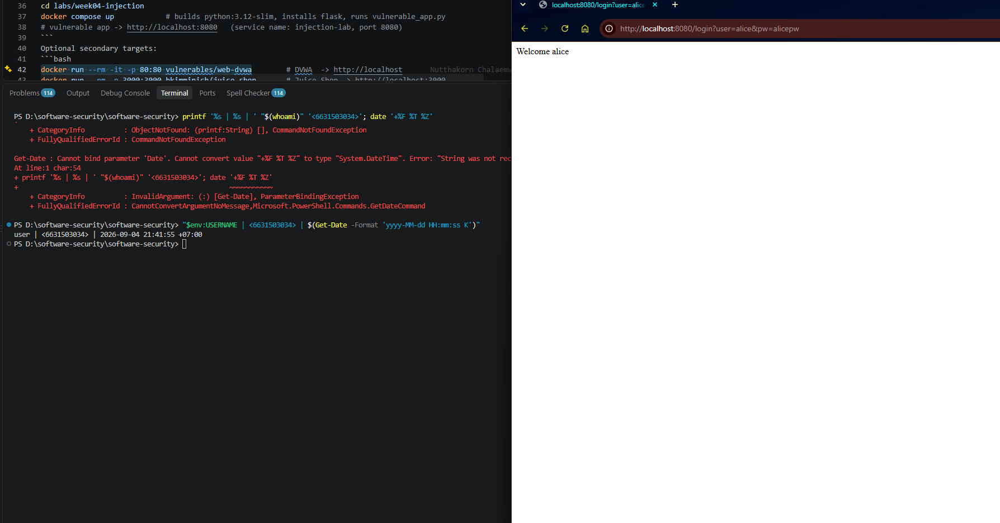
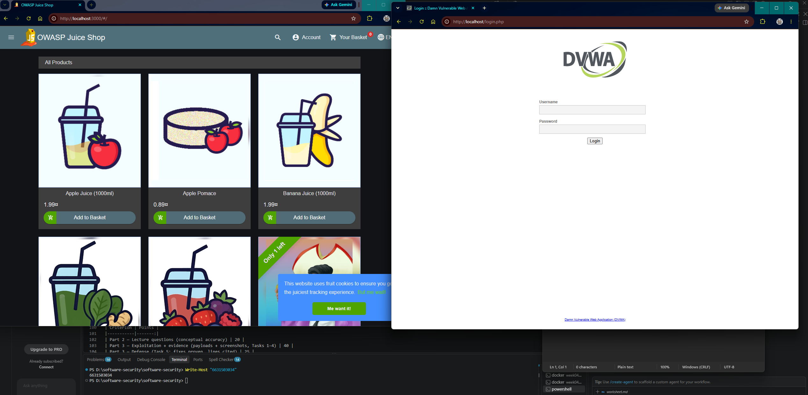
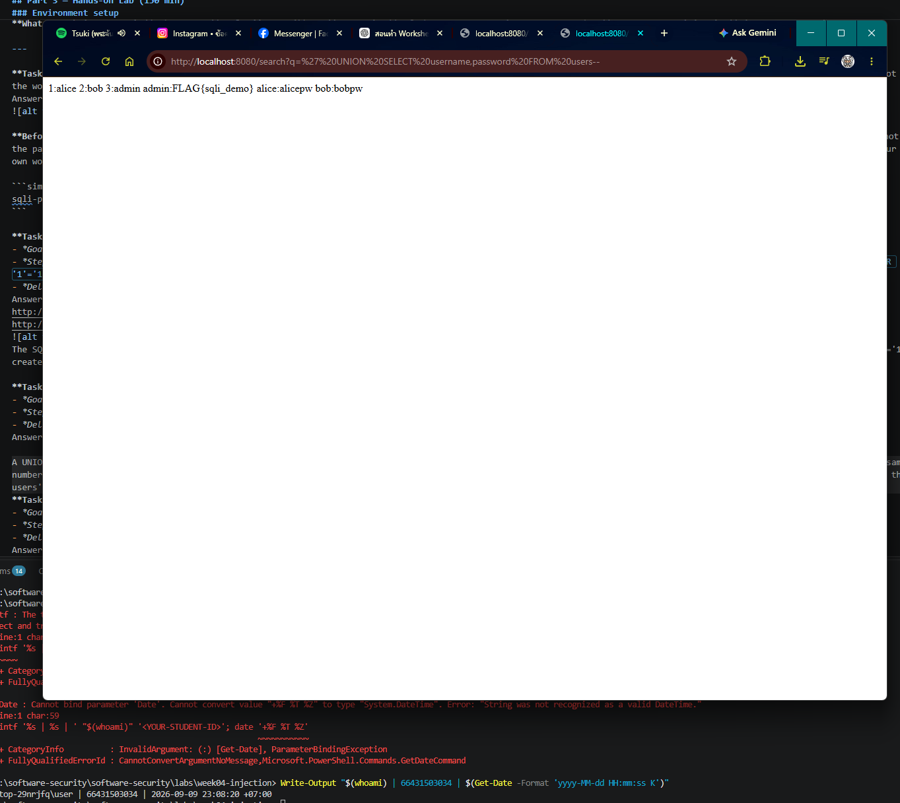
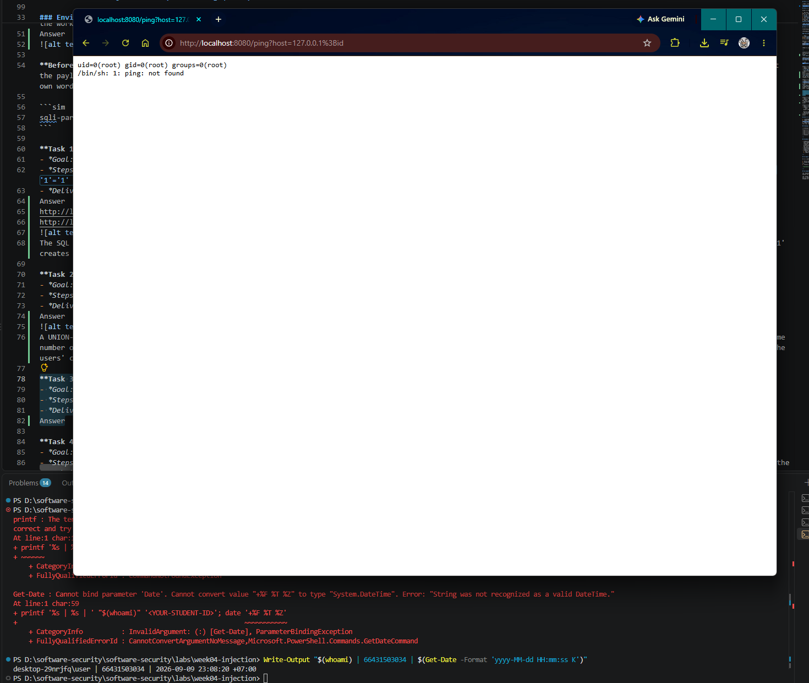
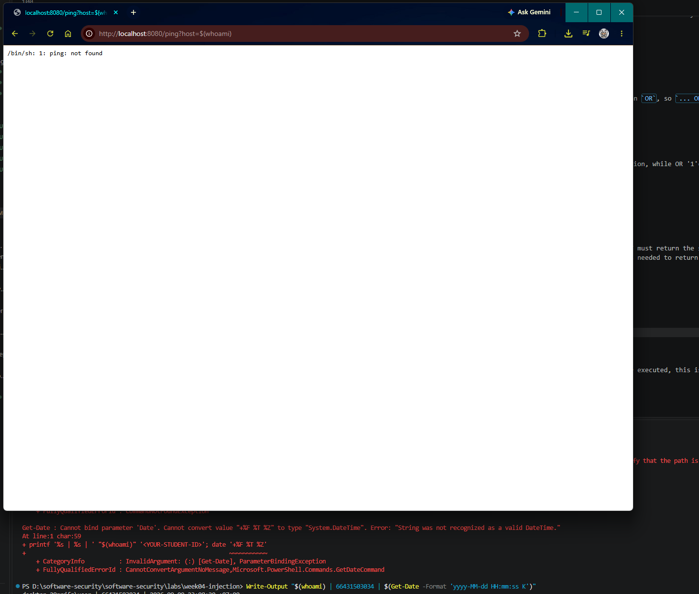
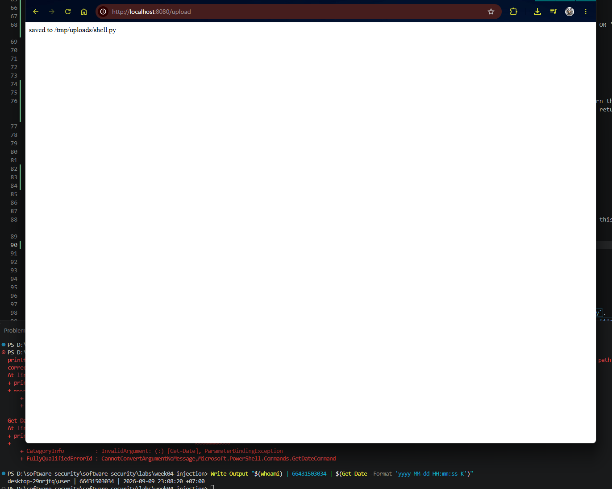
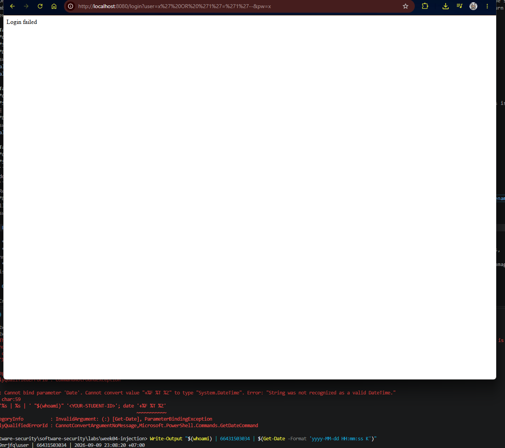
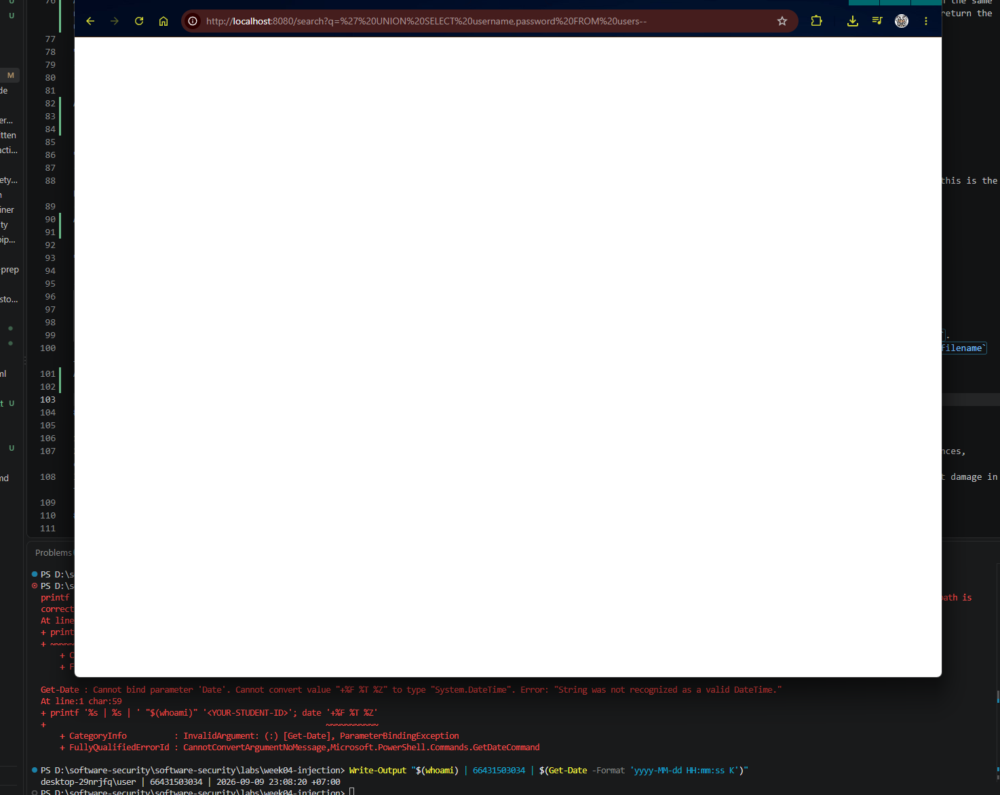
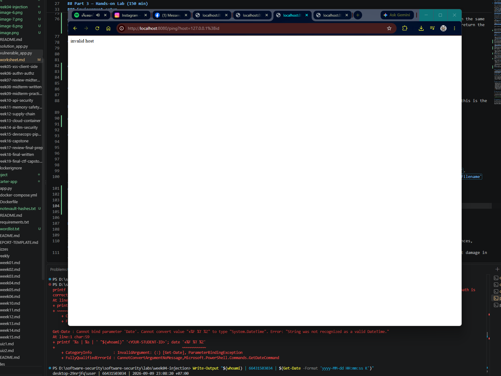
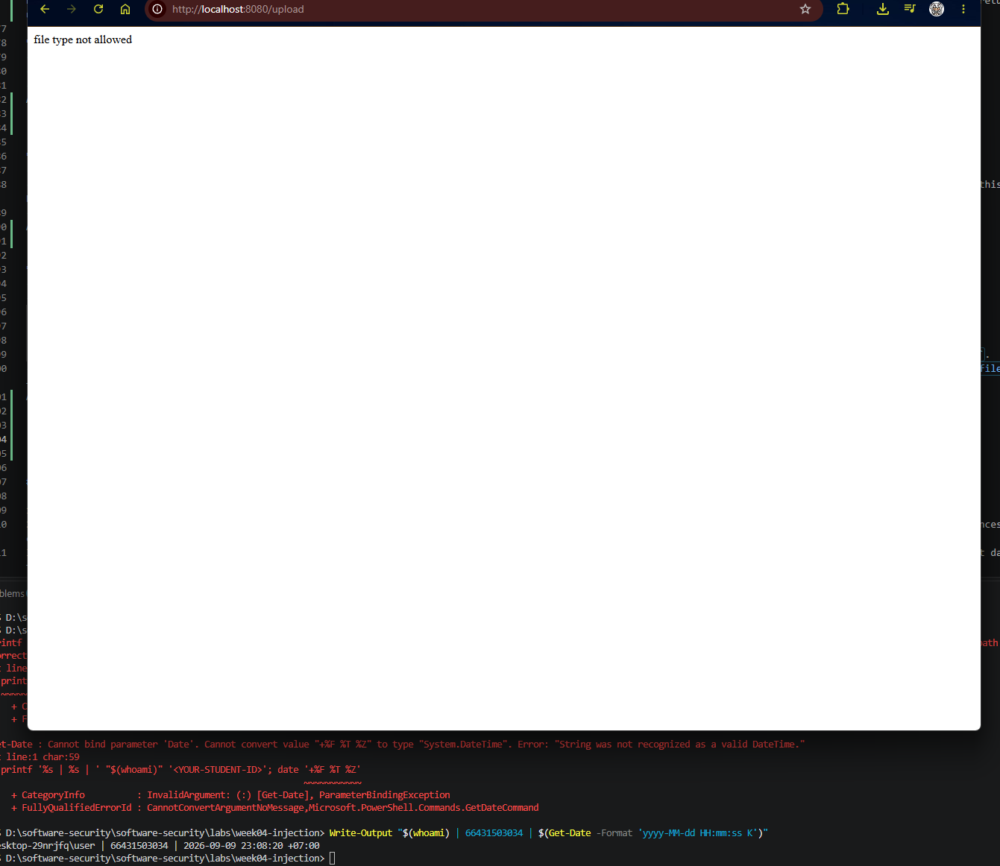

# Worksheet 4 — Injection & Input Handling (3 hrs)

> **Course:** Software Security (KOSEN69) · **Week 4**
> **Aligned:** OWASP 2025 **A05 Injection** · **CWE-89** (SQLi), **CWE-78** (OS command injection), **CWE-434** (unrestricted upload)
> **Signature game:** 🐉 **SQLi Boss Fight** — each successful injection lands a "hit" on the boss; the boss falls when you dump every credential and land an RCE.

> ⚠️ **Ethics note:** All payloads here are for the provided sandbox (`vulnerable_app.py`) and your own DVWA/Juice Shop containers **only**. Never test systems you do not own or have written permission to test. Unauthorized injection is a crime under most computer-misuse laws.

## Part 1 — Student Information

| Name | Student ID | Date | Group |
|------|-----------|------|-------|
|Phuriphat Chantiuaong|  66431503034|4/9/2560 |       |

## Part 2 — Lecture Questions

Answer in 2–4 sentences each.

1. Why does a **parameterized query** (`execute(sql, (params,))`) defeat SQL injection, while string formatting (`"... '%s'" % user`) does not? Reference how the database treats data vs. code.
2. In the `/ping` endpoint, `subprocess.run("ping -c 1 " + host, shell=True)` is vulnerable. Explain how `shell=True` turns user input into **CWE-78**, and how an argument array (`["ping","-c","1",host]`) removes the shell.
3. Distinguish **input validation** (allow-list) from **output handling**. Why is validation alone insufficient defense for SQLi?
4. The `/upload` route saves any filename to disk (**CWE-434**). What two properties must a directory and a filename have for an upload to become remote code execution, and which does `solution_app.py` remove?
5. What is a **UNION-based** SQLi, and why must the injected `SELECT` return the same number of columns as the original query? Relate to `/search?q=' UNION SELECT username,password FROM users--`.


## Part 3 — Hands-on Lab (150 min)

**Learning goals:** extract data via SQLi, achieve OS command injection, exploit an unrestricted upload, then prove each fix in `solution_app.py` blocks the payload.

**Prerequisites:** Docker + Docker Compose, `curl`, a browser. Working dir: `labs/week04-injection/`.

### Environment setup

```bash
cd labs/week04-injection
docker compose up            # builds python:3.12-slim, installs flask, runs vulnerable_app.py
# vulnerable app -> http://localhost:8080   (service name: injection-lab, port 8080)
```
Optional secondary targets:
```bash
docker run --rm -it -p 80:80 vulnerables/web-dvwa        # DVWA  -> http://localhost
docker run --rm -p 3000:3000 bkimminich/juice-shop       # Juice Shop -> http://localhost:3000
```

**What to submit per task:** the exact **payload/command**, a **screenshot** of the response proving success, and a **2–3 sentence mitigation** in your own words.

---

**Task 0 — Onboarding (5 min).** Browse to `http://localhost:8080/login?user=alice&pw=alicepw` and confirm `Welcome alice`. Note the seeded users (`alice`, `bob`). Screenshot the working app. *Deliverable: screenshot.*
Answer 


**Before you start — see why concatenation is the flaw** 🔬 Type any input and watch which characters the database will parse as *SQL* rather than as a name. The point is not the payload; it is that with concatenation the input becomes syntax, and with a parameterised query it structurally cannot. You will be asked to state that difference in your own words in Task 5.

```sim
sqli-parse
```

**Task 1 — Auth bypass via SQLi (25 min) 🐉 Hit #1.**
- *Goal:* log in as `alice` with **no valid password**.
- *Steps:* hit `/login?user=alice'--&pw=x`, then `/login?user=x' OR '1'='1'--&pw=x` (the trailing `--` is required: without it, SQL binds `AND` tighter than `OR`, so `... OR '1'='1' AND password='x'` matches no row). Observe the comment in the query at lines 61–63 of `vulnerable_app.py`.
- *Deliverable:* both URLs + screenshot of `Welcome alice` + explain why `--` and `OR '1'='1` work.
Answer
http://localhost/login.php
http://localhost:3000/#/

The SQL query directly uses the user's input, so the input can change the structure of the SQL statement. The -- comments out the remaining password condition, while OR '1'='1' creates a condition that is always true. Therefore, the application accepts the login without a valid password.

**Task 2 — Credential dump via UNION SQLi (30 min) 🐉 Hit #2.**
- *Goal:* exfiltrate every username **and password** from the `users` table.
- *Steps:* request `/search?q=' UNION SELECT username,password FROM users--`. Confirm `alice:alicepw` and `bob:bobpw` appear.
- *Deliverable:* payload + screenshot of dumped credentials + note on why column count must match.
Answer

A UNION-based SQL injection appends another SELECT statement to the original query so that additional database records can be returned. The injected SELECT must return the same number of columns as the original query because SQL UNION requires compatible result structures. In this lab, username and password provide the two columns needed to return the users' credentials.

**Task 3 — OS command injection (30 min) 🐉 Hit #3.**
- *Goal:* run an arbitrary command through `/ping`.
- *Steps:* request `/ping?host=127.0.0.1;id` then `/ping?host=$(whoami)` (URL-encode if needed). Capture the injected command's output.
- *Deliverable:* both payloads + screenshot of `id`/`whoami` output + explanation of the `shell=True` flaw (CWE-78).
Answer



**Task 4 — Unrestricted upload (25 min) 🐉 Hit #4.**
- *Goal:* show the upload accepts a dangerous file type with no checks (CWE-434).
- *Steps:* `GET /upload` (form), then upload a file named `shell.py`. Confirm `saved to /tmp/uploads/shell.py`. Discuss: if `UPLOAD_DIR` were web-served or executed, this is the RCE chain (here the dir is **not** served, so document the missing control rather than claiming auto-RCE).
- *Deliverable:* upload command/screenshot + 2–3 sentences on why extension allow-listing matters.
Answer


**Task 5 — Defend / fix it (35 min) 🛡️ Boss defeated.**
- *Goal:* prove `solution_app.py` blocks Tasks 1–4.
- *Steps:* stop the vulnerable container (`Ctrl-C`), then run the fixed app on the same compose env:
  ```bash
  docker compose run --rm --service-ports injection-lab bash -c "pip install --no-cache-dir flask && python solution_app.py"
  ```
  Re-fire each payload from Tasks 1–4. Expected: `Login failed`, no credential dump, `invalid host` (400) on `127.0.0.1;id`, and `file type not allowed` for `shell.py`.
- *Deliverable:* screenshots of all four failures + name the fix line for each (parameterized query L52–55 login / L62–66 search, `shell=False`+regex L74–77, `secure_filename`+allow-list L86–93).
Answer





## Part 4 — Reflection

1. **CWE/OWASP mapping:** map each of your four exploits to its CWE (89/78/434) and to OWASP 2025 **A05 Injection**.
   Answer
   Task 1 (auth bypass) → CWE-89 SQL Injection
   Task 2 (UNION dump) → CWE-89 SQL Injection
   Task 3 (ping RCE) → CWE-78 OS Command Injection
   Task 4 (upload) → CWE-434 Unrestricted Upload of File with Dangerous Type

All four vulnerabilities fall under **OWASP 2025 A05 Injection** because they share the same underlying problem: the application directly passes **user-controlled input** into a **powerful interpreter** (such as a SQL engine, OS shell, or filesystem) without properly separating **data** from **code or commands**.

2. **Real breach:** the **2017 Equifax breach** exposed ~147M people after attackers exploited a known input-handling flaw (Apache Struts CVE-2017-5638). In 3–4 sentences, connect that failure to the lessons in this lab (untrusted input reaching a powerful interpreter; the cost of an unpatched/unvalidated input path).
   Answer
   The 2017 Equifax breach shows how dangerous it can be when an application does not properly handle untrusted input. Attackers exploited a known vulnerability in Apache Struts (CVE-2017-5638), which allowed malicious input to reach a powerful processing mechanism on the server. This is similar to the lab because the vulnerable endpoints trusted user-controlled input and allowed it to reach SQL, operating-system commands, or file-handling functionality. The incident also shows that even a known vulnerability can become extremely costly when the vulnerable software is not patched and the input path is not properly protected.
3. **Best mitigation:** of parameterized queries, allow-list validation, least privilege, and avoiding `shell=True`, which single control would have prevented the most damage in this lab, and why?
  Answer
  Of the four controls, least privilege would have prevented the most damage in this lab. Parameterized queries would stop SQL injection, allow-list validation would reduce dangerous input, and avoiding shell=True would make OS command injection much harder. However, least privilege limits what an attacker can do even if an injection vulnerability is successfully exploited. For example, if the application runs with a restricted account, an attacker may still exploit the vulnerability but would have fewer permissions to access files, execute commands, or modify the system.
## Grading rubric (100)

| Criterion | Points |
|-----------|-------:|
| Part 2 — Lecture questions (conceptual accuracy) | 20 |
| Part 3 — Exploitation + evidence (payloads + screenshots, Tasks 1–4) | 40 |
| Part 3 — Defense (Task 5: fixes proven, lines cited) | 25 |
| Part 4 — Reflection (CWE/OWASP mapping, breach, mitigation) | 15 |
| **Total** | **100** |

---

## Evidence & Integrity (required)

- **Identity proof:** every screenshot/diagram must show a terminal running `printf '%s | %s | ' "$(whoami)" '<YOUR-STUDENT-ID>'; date '+%F %T %Z'` **in the
  same image as the evidence**. When the evidence is a browser page, a DevTools panel or a
  rendered response, put that terminal **beside the browser and capture the whole screen** — a
  cropped window carries nothing that identifies you, and the lab's own output is
  byte-identical for the whole cohort *by design*, so the stamp is the only thing that makes
  the shot yours. Generic or borrowed evidence is not accepted.
- **Personalized flag (if this lab issues one):** ____________________
  *Flags are unique per student — submitting another student's flag is a violation. How to submit: **learn.zcr.ai/submit** (full guide: `SUBMISSION.md` in the repo root).*
- **Explain in your own words** *(graded on your reasoning, not copied text):*
  1. What did you do, and **why did the vulnerability work**?
   Answer
   I tested the vulnerable endpoints using specially crafted input instead of normal user input. The vulnerabilities worked because the application directly trusted user-controlled data and passed it into sensitive operations such as SQL queries, operating-system commands, or file handling. The application did not properly separate data from instructions, so my input could change how the underlying operation was interpreted.
  2. **Why does your fix actually stop it** — and what could still break it?
  Answer
  The fixes stop the attacks by treating user input as data instead of executable instructions. For example, parameterized queries separate SQL code from user data, allow-list validation only accepts expected values, and removing shell=True prevents user input from being interpreted by a shell. However, the application could still be vulnerable if another endpoint uses unsafe input handling or if validation is incomplete.
---

## 🤖 Audit the AI (required)

AI is a power tool you must **distrust** — you are graded on your *critique*, not the AI's answer.

1. Ask an AI assistant to exploit **or** fix this week's vulnerability. Paste its full answer.
   Answer
   The AI suggested fixing the command injection vulnerability by validating the hostname and then executing:
   subprocess.check_output(f"ping -c 1 {host}", shell=True)
   It also suggested that validating the input would make the command safe.
2. **Find what's wrong or risky** in it — insecure code, a subtly incomplete fix, a hallucinated API/function/CVE, a missed edge case, or wrong reasoning. Quote the exact line(s).
   Answer
   The risky line is:
   subprocess.check_output(f"ping -c 1 {host}", shell=True)
   This is still dangerous because shell=True causes the command to be interpreted by a shell. If the validation can be bypassed or contains an overlooked edge case, an attacker may still inject shell syntax. The safer approach is to pass the command as a list of arguments and avoid the shell entirely.
3. Produce the **correct, verified** version yourself and explain in 2–3 sentences why the AI's output was insufficient.
  Answer
  A safer implementation is:
  subprocess.check_output(
    ["ping", "-c", "1", host],
    text=True
  )
  The input should also be restricted to an appropriate allow-list, such as a valid hostname or IP address.
  The AI's answer was insufficient because it kept shell=True and assumed that validation alone would completely solve the problem. My verified version removes the shell interpretation entirely, which prevents shell metacharacters in the input from being interpreted as additional commands.

> Disclose your AI use in the Part 1 table. This task counts toward your **Defense + Reflection** score.

---

## 🧠 Comprehension & Prompt (required)

**A. Explain in Plain English (EiPE).** In 2–3 sentences, in your own words, describe what this week's vulnerable code/endpoint actually *does* and *why it is exploitable* — explain the mechanism, don't dump jargon.
Answer
The vulnerable endpoint takes information supplied by the user and uses it directly in a sensitive operation without properly separating data from instructions. Because the application trusts the input, an attacker can provide specially crafted values that change what the application executes instead of only providing normal data.

**B. Prompt Problem.** Write a **single prompt** that makes an AI produce a *correct, secure* fix for one finding. Run it: does the exploit now fail? If not, refine the prompt and try again. Submit the **final prompt + the verified result**.
*Graded on the prompt's precision and your verification — this trains problem decomposition and AI literacy (Denny et al. 2024).*
Answer
Fix the identified command injection vulnerability securely. Do not use shell=True under any circumstances. Treat all user input as untrusted. Use a list of arguments with subprocess so that the input is passed as data rather than shell syntax. Add appropriate allow-list validation for the expected hostname or IP-address format. Do not rely on blacklist filtering. Keep the existing application behavior unchanged where possible. Show the exact code changes and briefly explain why the fix prevents command injection. After applying the fix, verify it by testing both a normal valid input and the previous command-injection payload, and confirm that the malicious payload no longer executes.

Verified Result
After applying the fix, a normal hostname/IP input continued to work as expected. The previous command-injection payload was no longer interpreted as a shell command because the application no longer passed the input through a shell. Therefore, the exploit failed while the intended ping functionality still worked.

Why this prompt is effective
The prompt explicitly identifies the dangerous behavior, prohibits shell=True, requires argument separation, and requires allow-list validation. It also requires verification using both normal input and the original malicious payload, so the fix is tested rather than accepted only because the code looks secure.