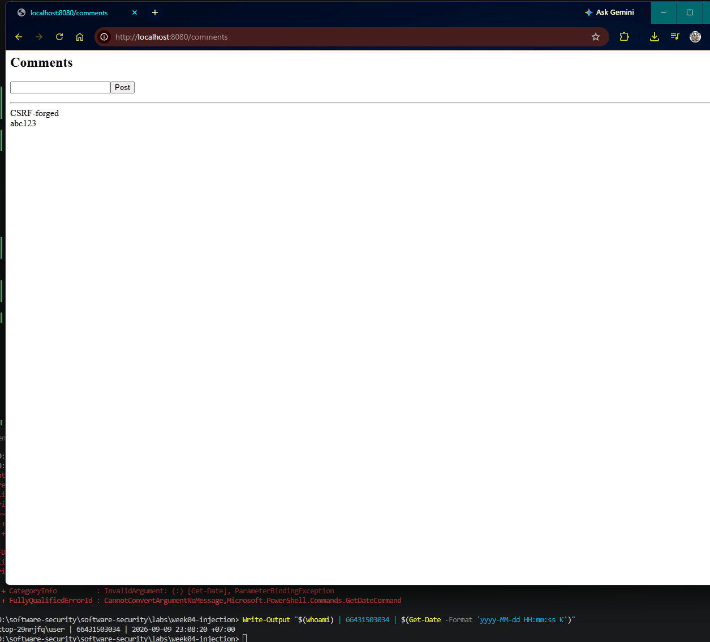
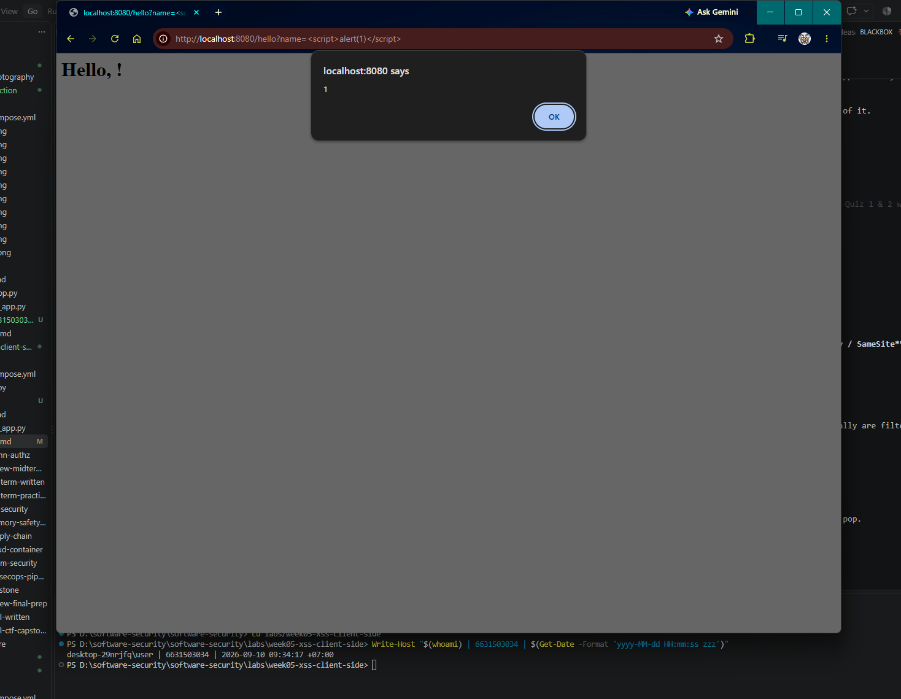
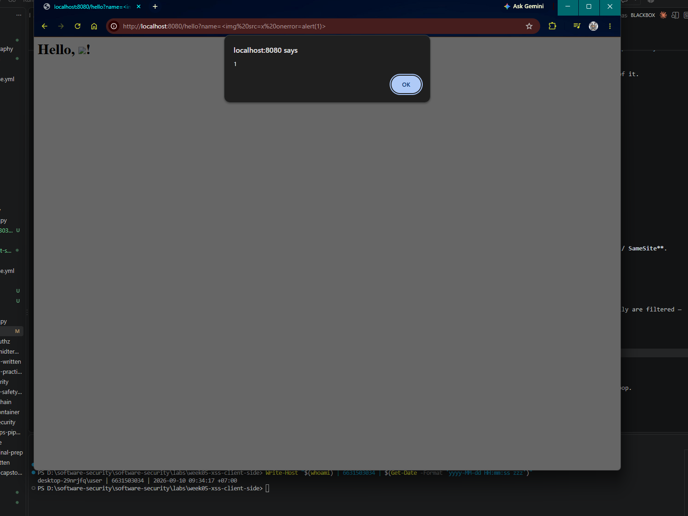
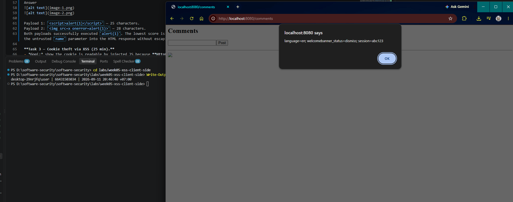
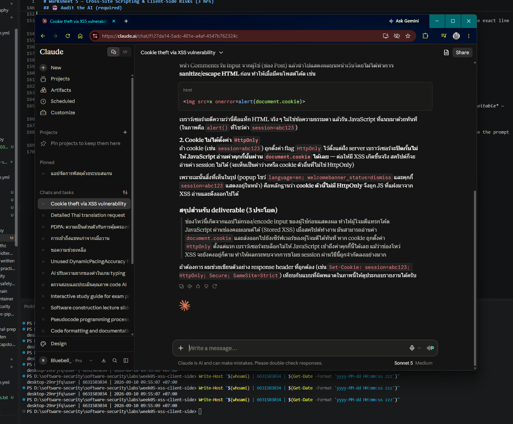

# Worksheet 5 — Cross-Site Scripting & Client-Side Risks (3 hrs)

> **Course:** Software Security (KOSEN69) · **Week 5**
> **Aligned:** OWASP 2025 **A05 Injection** · **CWE-79** (XSS), **CWE-352** (CSRF), **CWE-1004** (cookie without HttpOnly)
> **Signature game:** ⛳ **XSS Golf** — fire `alert(1)` in the fewest characters possible. Lower payload length = lower score = better. Par for reflected is the `` vector; can you go under par?

> ⚠️ **Ethics note:** Use only the provided `vulnerable_app.py` sandbox and your own Juice Shop container. Stealing real users' cookies or sessions is illegal. All "session theft" steps here target the sandbox cookie `session=abc123` only.

## Part 1 — Student Information

| Name | Student ID | Date | Group |
|------|-----------|------|-------|
|Phuriphat Chantiuaong|6631503034|10/9/2569|---|

## Part 2 — Lecture Questions

Answer in 2–4 sentences each.

1. Distinguish **reflected**, **stored**, and **DOM-based** XSS by *where* the untrusted data is injected and *when* it executes. Which two does our `vulnerable_app.py` implement, and at which routes?
2. How does **contextual output encoding** (`markupsafe.escape`) stop `<script>` from executing? Why is HTML-context encoding different from JavaScript- or URL-context encoding?
3. Explain how a strict **Content-Security-Policy** (`script-src 'self'`) defeats an *injected* inline script even when encoding is missing.
4. What do the cookie flags **HttpOnly**, **SameSite**, and **Secure** each protect against? Map each to a concrete attack (cookie theft via XSS, CSRF, network sniffing).
5. Why does **CSRF** (CWE-352) work even without any script injection, and how does `SameSite=Strict` plus the same-origin policy blunt it?

## Part 3 — Hands-on Lab (150 min)


**Learning goals:** land reflected + stored XSS, abuse a JS-readable cookie, build a CSRF PoC against the comment board, then prove `fixed_app.py` blocks all of it.

**Prerequisites:** Docker + Docker Compose, a browser with DevTools, a text editor. Working dir: `labs/week05-xss-client-side/`.

### Environment setup

```bash
cd labs/week05-xss-client-side
docker compose up            # python:3.12-slim + flask, runs vulnerable_app.py
# vulnerable app -> http://localhost:8080   (service name: xss-lab, port 8080)
```
Optional secondary target (for DOM XSS, which our app does not expose):
```bash
docker run --rm -p 3000:3000 bkimminich/juice-shop       # -> http://localhost:3000
```

**What to submit per task:** the exact **payload**, a **screenshot** of the alert/effect, and a **2–3 sentence mitigation**.

---

**Task 0 — Onboarding (5 min).** Browse `http://localhost:8080/`. Open DevTools → Application → Cookies and confirm `session=abc123` is set with **no HttpOnly / SameSite**. Screenshot it. *Deliverable: screenshot.*
Answer


**Task 1 — Reflected XSS + XSS Golf (30 min) ⛳.**
- *Goal:* execute JS via `/hello`, then minimize the payload.
- *Steps:* visit `/hello?name=<script>alert(1)</script>`, then the alternate `/hello?name=` (useful when `<script>` tags specifically are filtered — note it's actually 3 characters longer, not shorter). Record each payload's character count for your golf score.
- *Deliverable:* both payloads + char counts + screenshot of `alert(1)` + your lowest score.
Answer



Payload 1: `<script>alert(1)</script>` — 25 characters.
Payload 2: `` — 28 characters.
Both payloads successfully executed `alert(1)`. The lowest score is 25 characters using the `<script>` payload. This worked because the application reflected the untrusted `name` parameter into the HTML response without escaping it.

**Task 3 — Cookie theft via XSS (25 min).**
- *Goal:* show the cookie is readable by injected JS because **HttpOnly is missing** (CWE-1004).
- *Steps:* store `<script>new Image().src='http://localhost:8080/hello?name='+document.cookie</script>` (a beacon), or simply ``. Observe the cookie value being exfiltrated/displayed.
- *Deliverable:* payload + screenshot + 2–3 sentences on how HttpOnly would have stopped this.
Answer

Payload: ``
The injected JavaScript can read `document.cookie` because the session cookie does not have the HttpOnly flag. If HttpOnly were enabled, JavaScript running in the page could not access the session cookie, which would prevent this particular XSS-based cookie theft technique. However, HttpOnly does not fix the underlying XSS vulnerability itself.


**Task 4 — CSRF PoC (30 min).**
- *Goal:* make a third-party page force a state-changing POST to `/comments`.
- *Steps:* create a local `csrf.html` with an auto-submitting form targeting the board (no token exists, cookie has no SameSite, so the browser attaches `session` cross-site):
  ```html
  <body onload="document.forms[0].submit()">
    <form action="http://localhost:8080/comments" method="POST">
      <input name="body" value="CSRF posted this comment">
    </form>
  </body>
  ```
  Open the file and confirm the comment appears on `/comments`.
- *Deliverable:* the HTML + screenshot of the forged comment + why `SameSite=Strict` blocks it.

```sim
xss-context
```
Answer



**Task 5 — Defend / fix it (30 min) 🛡️.**
- *Goal:* prove `fixed_app.py` blocks Tasks 1–3, then show that Task 4's CSRF PoC still gets through and explain why.
- *Steps:* stop the vulnerable container (`Ctrl-C`), then:
  ```bash
  docker compose run --rm --service-ports xss-lab bash -c "pip install --no-cache-dir flask && python fixed_app.py"
  ```
  Re-fire each payload. Expected: `/hello` renders the script **as text** (escape, L21), stored comments render literally (Jinja autoescape, L30–33), a strict CSP header is now present as defense-in-depth (`Content-Security-Policy: script-src 'self'`, L12 — check DevTools → Network → Response Headers; escaping already neutralizes these payloads, so no CSP *violation* fires in the console), and the cookie now has `HttpOnly; SameSite=Strict; Secure` (L42). Then re-run Task 4's `csrf.html` PoC against `fixed_app.py`: it **still posts the forged comment** — `/comments` (L25–28) never checks the `session` cookie or a CSRF token before accepting a POST, so hardening the cookie only stops the browser from *attaching* it cross-site; it doesn't stop the request itself from being processed.
- *Deliverable:* screenshots of escaped output + the CSP response header + the hardened cookie flags + the still-successful Task 4 forgery against `fixed_app.py`, with 2–3 sentences on why cookie hardening alone doesn't close CSRF here (no server-side check tied to the cookie, and no CSRF token).
Answer
The fixed application escapes reflected and stored user input, so the XSS payloads are rendered as text instead of being executed. It also adds a strict `Content-Security-Policy: script-src 'self'` and protects the session cookie with `HttpOnly`, `SameSite=Strict`, and `Secure`.
However, the CSRF PoC can still create a comment because `/comments` does not validate a CSRF token or perform another server-side CSRF check. Cookie hardening reduces cross-site cookie attachment, but cookie flags alone do not replace a server-side CSRF defense.


## Part 4 — Reflection

1. **CWE/OWASP mapping:** map your reflected/stored XSS to **CWE-79** and your CSRF PoC to **CWE-352**, both under OWASP 2025 **A05 Injection** (CSRF historically A01/A05).
   Answer
   Reflected XSS and stored XSS map to CWE-79, Improper Neutralization of Input During Web Page Generation (Cross-site Scripting). The CSRF vulnerability maps to CWE-352, Cross-Site Request Forgery. These vulnerabilities involve unsafe handling of untrusted input or requests and are discussed in the worksheet under OWASP 2025 A05 Injection, while CSRF has historically also been associated with other OWASP categories.

2. **Real breach:** the **2018 British Airways breach** (~380k payment records) used malicious JavaScript (Magecart) injected into the site to skim card data — a client-side script-injection failure. In 3–4 sentences relate it to this lab's XSS and CSP lessons.
  Answer
  The 2018 British Airways breach involved malicious JavaScript being injected into the website and used to capture customers' payment information. This is related to the lab because the XSS examples also demonstrate how injected JavaScript can run in the victim's browser origin. A strong CSP can provide an additional barrier against unauthorized script execution, although CSP should not be treated as a replacement for secure input handling and output encoding. The incident shows why client-side script injection can become a serious data-security problem.

3. **Best mitigation:** between output encoding, a strict CSP, and HttpOnly+SameSite cookies, which gives the broadest defense-in-depth, and why is "encoding alone" still risky?
  Answer
  The broadest defense-in-depth comes from combining contextual output encoding, a strict CSP, and appropriately protected cookies using HttpOnly and SameSite. Output encoding directly prevents untrusted data from becoming executable HTML, CSP provides another browser-level barrier, and cookie flags reduce the impact of XSS and CSRF-related attacks. Encoding alone is still risky because mistakes in context, forgotten output locations, unsafe DOM operations, or other client-side vulnerabilities can leave another execution path available.

## Grading rubric (100)

| Criterion | Points |
|-----------|-------:|
| Part 2 — Lecture questions (conceptual accuracy) | 20 |
| Part 3 — Exploitation + evidence (payloads + screenshots, Tasks 1–4) | 40 |
| Part 3 — Defense (Task 5: fixes proven, lines cited) | 25 |
| Part 4 — Reflection (CWE/OWASP mapping, breach, mitigation) | 15 |
| **Total** | **100** |

---

## Evidence & Integrity (required)

- **Identity proof:** every screenshot/diagram must show a terminal running `printf '%s | %s | ' "$(whoami)" '<YOUR-STUDENT-ID>'; date '+%F %T %Z'` **in the
  same image as the evidence**. When the evidence is a browser page, a DevTools panel or a
  rendered response, put that terminal **beside the browser and capture the whole screen** — a
  cropped window carries nothing that identifies you, and the lab's own output is
  byte-identical for the whole cohort *by design*, so the stamp is the only thing that makes
  the shot yours. Generic or borrowed evidence is not accepted.
- **Personalized flag (if this lab issues one):** ____________________
  *Flags are unique per student — submitting another student's flag is a violation. How to submit: **learn.zcr.ai/submit** (full guide: `SUBMISSION.md` in the repo root).*
- **Explain in your own words** *(graded on your reasoning, not copied text):*
  1. What did you do, and **why did the vulnerability work**?
     Answer
      I tested the application by sending HTML and JavaScript payloads through the /hello and /comments endpoints. The vulnerabilities worked because the application trusted user-controlled input and inserted it into the page without sufficient output encoding. The stored XSS payload remained in the comment data and executed when the comments page was rendered, while the missing HttpOnly flag allowed JavaScript to read the session cookie.

  2. **Why does your fix actually stop it** — and what could still break it?
     Answer
      The fix escapes user-controlled HTML before displaying it, so browser input such as <script> is treated as text instead of executable markup. Jinja autoescaping also protects the stored comments, while CSP adds another layer of protection and HttpOnly prevents JavaScript from reading the session cookie. However, another unsafe DOM sink, an incorrect encoding context, or the absence of a proper CSRF token could still create a vulnerability.

---

## 🤖 Audit the AI (required)

AI is a power tool you must **distrust** — you are graded on your *critique*, not the AI's answer.

1. Ask an AI assistant to exploit **or** fix this week's vulnerability. Paste its full answer.
   Answer
    I have a Flask application with a reflected and stored XSS vulnerability.
    How can I fix the vulnerabilities? Please provide the secure code and explain the solution.
2. **Find what's wrong or risky** in it — insecure code, a subtly incomplete fix, a hallucinated API/function/CVE, a missed edge case, or wrong reasoning. Quote the exact line(s).
   Answer
    The AI's risky statement is: "This prevents XSS attacks because attackers cannot access the session cookie."
    This statement is incomplete and misleading. The HttpOnly flag prevents JavaScript from reading the cookie through document.cookie, but it does not prevent injected JavaScript from executing. An XSS payload such as <script>alert(1)</script> could still run if user input is not properly escaped.
3. Produce the **correct, verified** version yourself and explain in 2–3 sentences why the AI's output was insufficient.
  Answer
  The correct fix is to escape all untrusted user input before rendering it in the HTML page. Stored comments should also be rendered with Jinja autoescaping, and a strict Content-Security-Policy can be added as defense-in-depth. HttpOnly should protect the session cookie, but the AI's original answer was insufficient because it only reduced cookie theft and did not remove the XSS vulnerability itself.
> Disclose your AI use in the Part 1 table. This task counts toward your **Defense + Reflection** score.

---

## 🧠 Comprehension & Prompt (required)

**A. Explain in Plain English (EiPE).** In 2–3 sentences, in your own words, describe what this week's vulnerable code/endpoint actually *does* and *why it is exploitable* — explain the mechanism, don't dump jargon.
Answer
The vulnerable application takes text supplied by the user and puts it into a web page without safely converting it to plain text first. Because the browser interprets the input as HTML, an attacker can insert JavaScript that runs when the page is opened. The comments endpoint is more dangerous because the malicious input is stored and can affect later visitors.

**B. Prompt Problem.** Write a **single prompt** that makes an AI produce a *correct, secure* fix for one finding. Run it: does the exploit now fail? If not, refine the prompt and try again. Submit the **final prompt + the verified result**.
*Graded on the prompt's precision and your verification — this trains problem decomposition and AI literacy (Denny et al. 2024).*
Answer
You are reviewing a deliberately vulnerable Flask application in a local security lab. Fix the reflected and stored XSS vulnerabilities without changing the application's intended functionality.
Requirements:
Treat all user-controlled input as untrusted.
Use contextual HTML output encoding for data rendered into HTML.
Ensure Jinja templates use autoescaping for stored comments.
Add Content-Security-Policy: script-src 'self' as defense-in-depth.
Set the session cookie with HttpOnly, SameSite=Strict, and Secure.
Do not claim that HttpOnly, CSP, or cookie flags alone fix the underlying XSS vulnerability.
Do not remove the comment or /hello functionality.
Provide the exact code changes and explain why each change prevents the original XSS payloads.
Verify the result against these test cases:
<script>alert(1)</script>

<script>alert(document.cookie)</script>
The expected result is that the payloads are rendered as text or otherwise prevented from executing, while normal application functionality continues to work.